# **前言 -  Azure OpenAI Service 入门**

本书是为 .NET 开发者而写的，让 .NET 开发者能快速掌握 Azure OpenAI Service 的使用技巧。

ChatGPT 的到来意味着我们已经置身于 AI 引起的全新变革中，作为开发者你将面临几种改变：

1. GPT 模型到来后，我们如何去架构好企业解决方案的问题。
2. Prompt 工程的到来，开发者是否能成功转型？
3. 如何打通 GPT 和企业数据？
4. 原来的人工智能技术还有用吗？
5. Azure OpenAI Service 和 OpenAI Service 比有什么优势？

通过本书的相关章节，将逐一告诉大家。现在 AI 的变化是日新月异的，因此我决定把这个内容放到 GitHub 上，如果大家有任何问题也可以在 Issue 上告诉我，我会尽快回应。

## **一. 关于 Azure OpenAI Service**

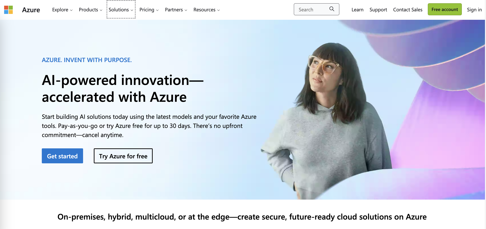

Microsoft Azure (https://azure.com) 是全球知名的云解决方案，微软和 OpenAI 合作，使 Microsoft Azure 也嵌入了 OpenAI 的服务，让企业能通过 Azure 快速打造基于 OpenAI 的行业解决方案。现在 Microsoft OpenAI Service 处于预览版阶段，只需要在线申请，符合条件通过后，就可以使用 Azure OpenAI Service 。

### **1.1 Azure OpenAI Service 和 OpenAI Service 之间有什么不同呢 ？**


1. **安全性** - Microsoft Azure OpenAI Service 有严格的数据、网络、身份安全机制，为企业的信息安全保驾护航。这就包括了密钥自动加密服务、数据隐私服务以及内容管理等。

2. **稳定性** - 通过 Microsoft Azure OpenAI Service 为企业带来更稳定的接口访问。

3. **可靠性** - 具备业务持续性和灾难恢复，当出现大范围故障时，还能从区域性故障中恢复，可以即时执行，而且成本非常低。


### **1.2 使用 Azure OpenAI Service**

要使用 Azure OpenAI Service 你需要拥有一个 Azure 账号，并通过该账号去申请 Azure OpenAI Service 。申请通过后，你就可以像一般的 Azure 服务一样通过资源组的方式，开始创建属于自己的 Azure OpenAI Service。

STEP 1. 进入 Azure Portal (https://portal.azure.com/) ，点击创建资源：

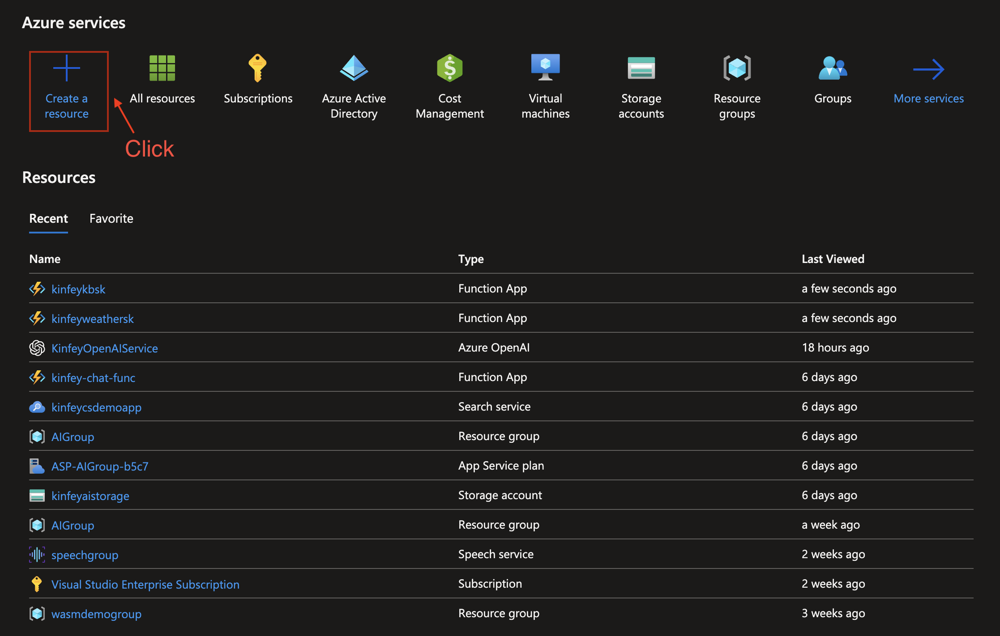

选择 Azure OpenAI 进行创建：

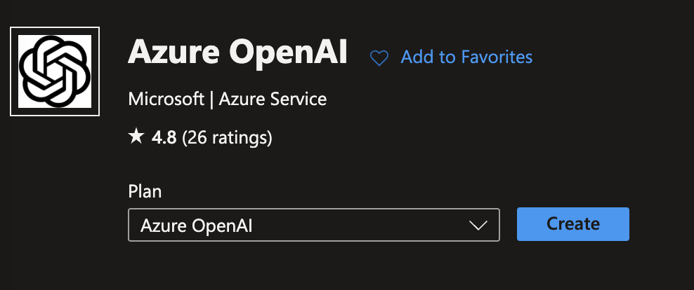

STEP 2. 创建过程需要选择你的 Azure 订阅，并创建相关资源组，以及选择区域(建议选择 South Central US)，并给一个唯一的名字，并选择价格，如图：

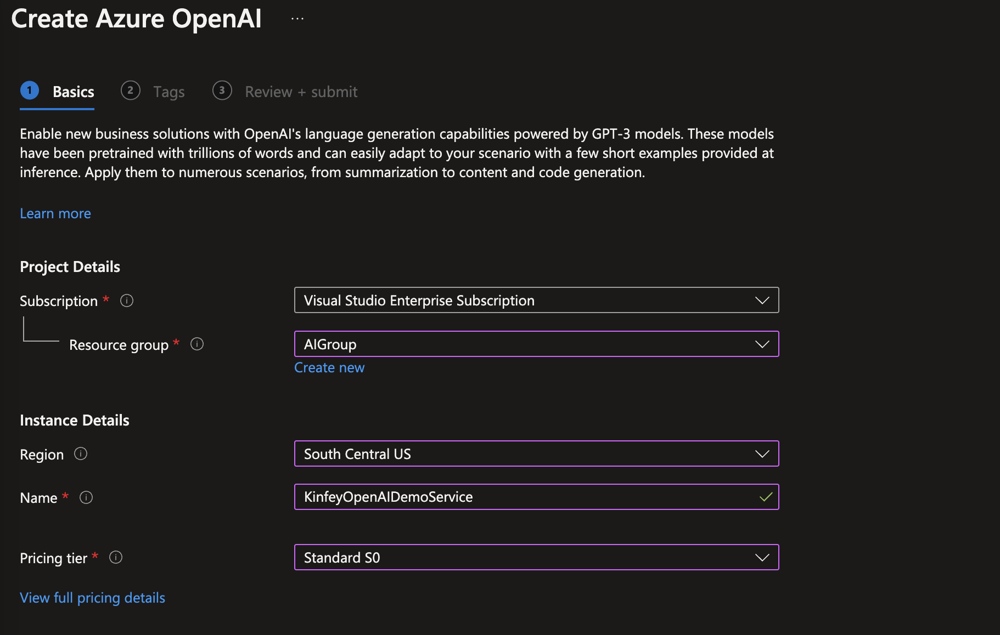

STEP 3. 创建成功后 ，选择模型部署选项，点击创建：

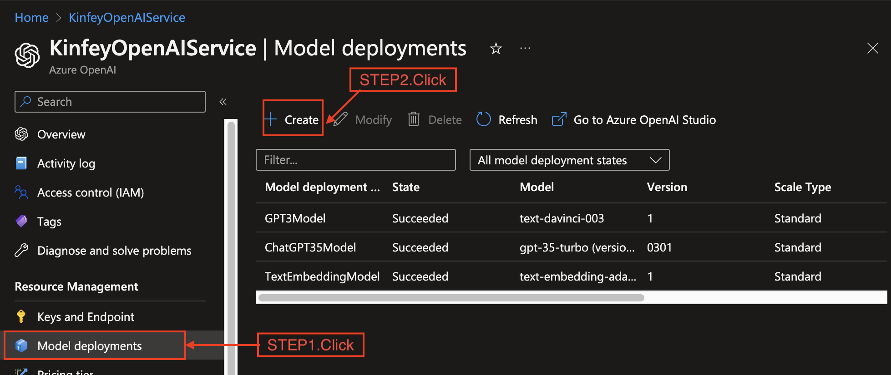

然后选择你所需要的模型进行部署：

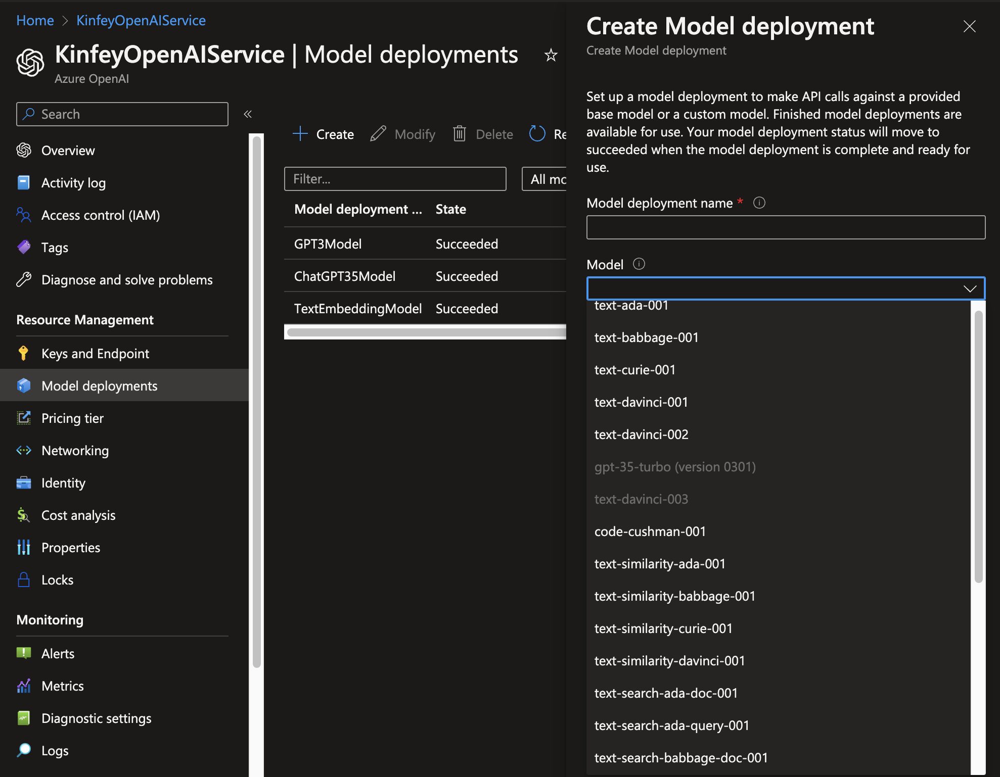

完成后就可以看到相关的列表。

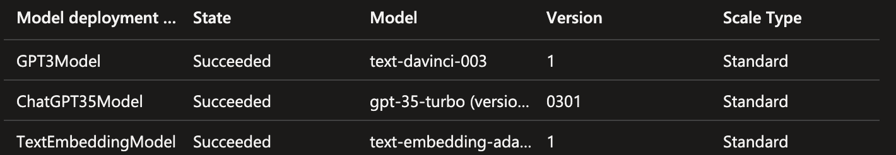

**注意**：现在 GPT-4 需要额外申请，具体请参考 https://aka.ms/oaiapply

## **二. 通过 Azure OpenAI Studio 管理你的 OpenAI 应用场景**

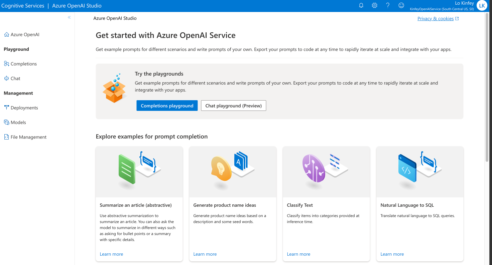

通过 Azure OpenAI Studio (https://oai.azure.com/portal) 你可以迅速完成 Azure OpenAI 模型的应用、部署及管理。我在这里选择一个简单的总结场景来完成相关的展示： 

1. 选择总结文章的示例场景：

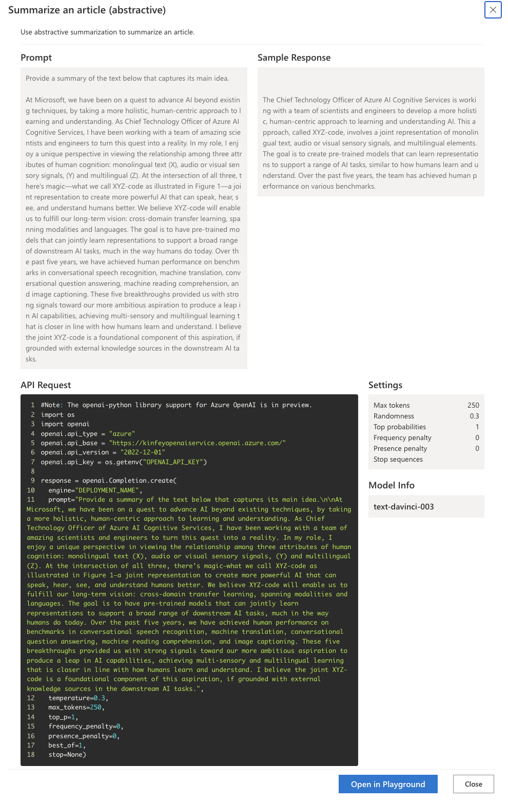

2. 点击进入 Playground 后，你就可以输入相关 Prompt 来完成一些应用设定：

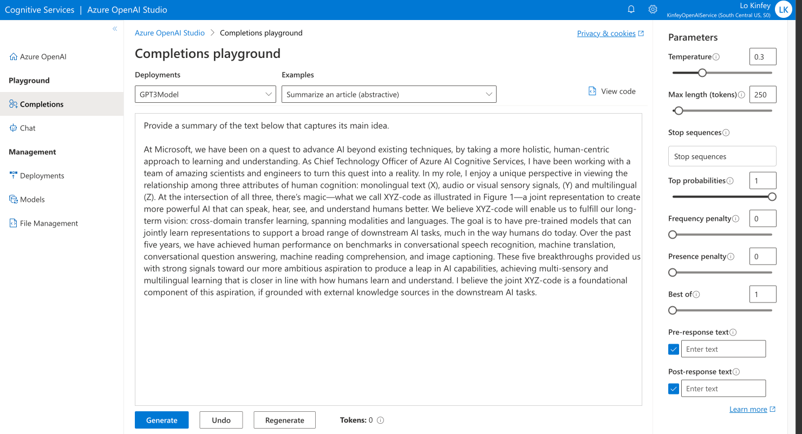

你也可以选择不同的参数进行调整 ， 当然选择 View code 也可以快速地查看相关代码 ，直接引用就可以给 Python 和 .NET 使用 ，其他语言也可以参考 curl , json 进行调整：

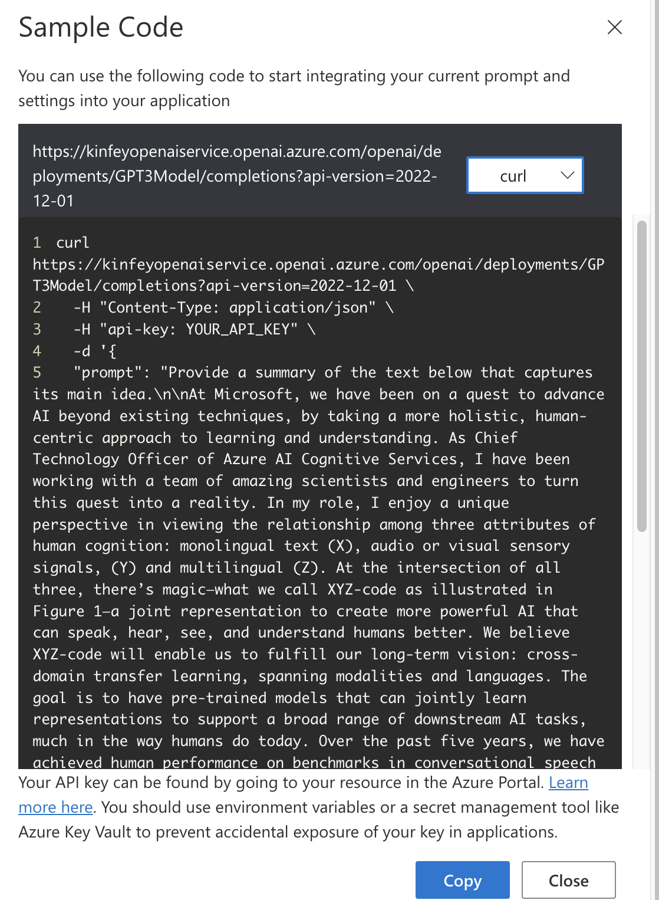

补充一下引用代码时别忘记添加 Key ， Key 所在位置在创建的 Azure OpenAI 资源里：

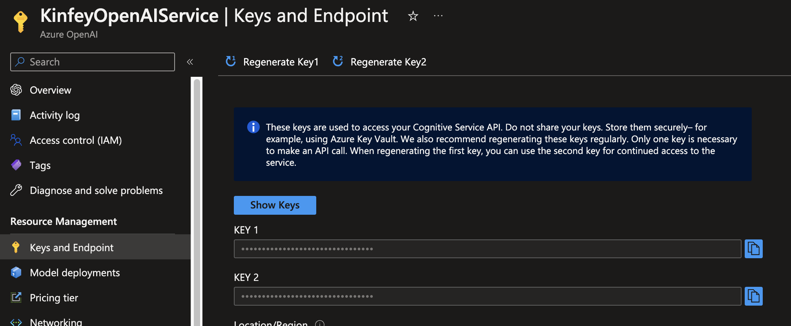

## **三. Azure OpenAI Service 的能力和概念**

我们在使用 Azure OpenAI Service 的使用，都会碰到一些概念，我们进行一个简单的入门：

### **3.1 Azure OpenAI 的能力**

Azure OpenAI 具备文本生成，代码生成，图像生成的三大能力：

**1. 文本生成**

文本生成能力具备文本归纳、分类、翻译、问答、创作、推荐等能力。在 Azure OpenAI Service 上，你可以通过部署 GPT-3 / GPT-3.5 / GPT-4 的模型为应用提供文本生成功能。我们如果在无需编码的时候，你可以使用 ChatGPT 体验强大的功能，当然你也可以通过 Azure OpenAI Studio 的 Playground 体验 ChatGPT。

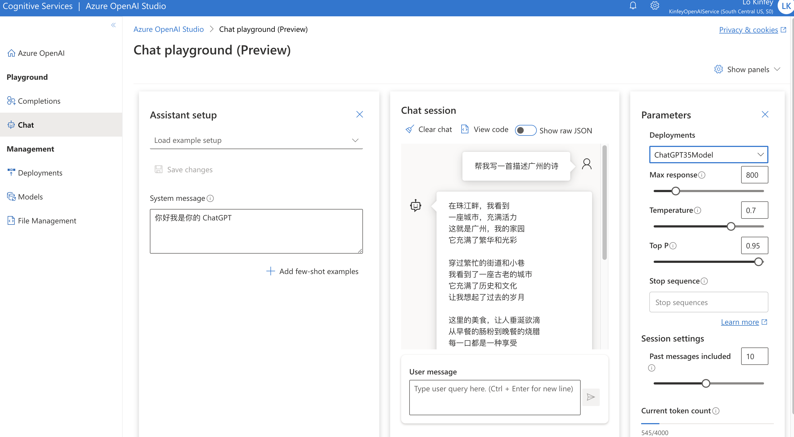


**2. 代码生成**

如果你已经是 GitHub Copilot 的用户，有惊艳到吗？你希望拥有一个自己企业的智能代码助手吗？通过 Azure OpenAI Service 提供的 Codex 模型就可以配合完成。Codex 模型基于 GPT-3，经过优化以理解和编写代码。 这些模型基于自然语言以及用来自公共存储库的数十亿行代码进行了训练。 Codex 能够从自然语言指令（如代码注释）生成代码，并且可以建议完成代码函数的方法。


**3. 图像生成**

处理图像的模型称为 DALL-E。 图像功能包括分为创建图像、编辑图像和创建图像变体这三类。


### **3.2 Azure OpenAI 的参数设定**

在 Azure OpenAI Studio 的 Playground 中，可以看到一些参数，这些参数对于生成式 AI 是非常重要的，下面我们就来学习一下：

**Temperature**

是控制生成的文本输出的随机程度的参数。 Temperature 值越高，输出的结果越随机，而值越低，输出的结果则越趋向于确定性。

**Token**

是指在自然语言处理中的一个概念，它是文本中的一个基本单元，通常是一个单词或一个标点符号。在自然语言处理中，为了方便处理文本，我们需要将文本中的每个单词或标点符号都转换为一个数字表示，这个数字就被称为 Token。在 OpenAI 的一些模型中，Token 还可以包括特殊的 Token，如起始 Token、结束 Token，用于指示模型的输入和输出。在使用 OpenAI 的模型进行训练或生成文本时，需要对文本进行分词和 Token 化处理，以便对文本进行处理和表示。

**Top K**

是指在自然语言处理中，使用的一个参数，用于控制生成文本的多样性。具体来说，Top K 参数指的是在生成下一个词时，只考虑概率值最高的前 K 个候选词，而不是所有可能的词。这样可以使得生成的文本更加多样化和有趣，避免出现过于模板化和单调的文本。通常情况下，K 的值会设置在几十到几百之间，具体取决于任务和数据集的不同。

**Top P**

是在自然语言处理中，用于控制生成文本的多样性的一种技术。具体来说，Top P 参数指的是在生成下一个词时，只考虑概率累加值最高的一组词，这组词的概率之和大于等于给定的阈值 P。而不是考虑所有可能的词。这个阈值 P 通常被设置在 0.1 到 0.9 之间，具体取决于任务和数据集的不同。Top P 技术可以使得生成的文本更加多样化，避免出现重复和单调的文本。

**Frequency Penalty**

是在自然语言处理中，用于控制生成文本的多样性的一种技术。具体来说，Frequency Penalty 可以用于降级那些在之前的生成文本中出现频率较高的词语，在生成下一个词时，这些词语的概率会被降低，从而鼓励模型生成更加多样化的文本。通过调整 Frequency Penalty 的大小，可以实现对文本多样性和流畅性的平衡。

**Presence Penalty**

是在自然语言处理中，用于控制生成文本的多样性的一种技术。Presence Penalty 可以用于降级那些在之前的生成文本中已经出现过的词语，在生成下一个词时，这些词语的概率会被降低，从而鼓励模型生成更加多样化的文本。与 Frequency Penalty 不同的是，Presence Penalty 不仅考虑了词语的出现频率，还考虑了词语是否已经出现过。通过调整 Presence Penalty 的大小，可以实现对文本多样性和流畅性的平衡。

## **四. .NET 开发者入门**


### **4.1 .NET for Azure OpenAI Service 基础**

Azure OpenAI Service 提供了 REST 的 API 给不同语言进行调用，针对 .NET 用户更发布了基于 Azure OpenAI 的 .NET SDK , .NET 开发者可以快速接入进行 Azure OpenAI 应用场景的开发。


```bash

dotnet add package Azure.AI.OpenAI 

```

当然你也可以用 HttpClient 的方式直接访问 endpoint 来完成。


对于要探索 Azure OpenAI Service 的 .NET 开发者，个人建议使用 Notebook 的方式来配合。你只需要通过最新的 .NET SDK 7 和 Visual Studio Code 及 .NET Extensions Pack 的 Visual Studio Code 插件就可以通过 Polyglot Notebook 做交互式的开发体验。这样的好处是，更方便调整参数和优化 OpenAI 的代码。

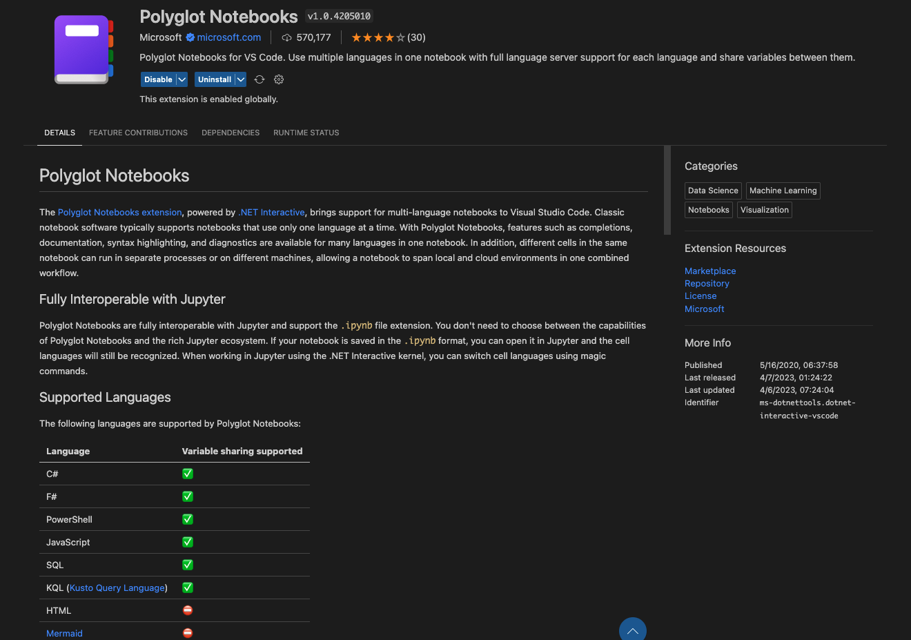

以下是用 Polyglot Notebook 调用 Azure OpenAI Service 中 GPT-3.5 turbo 的 Notebook 实现:

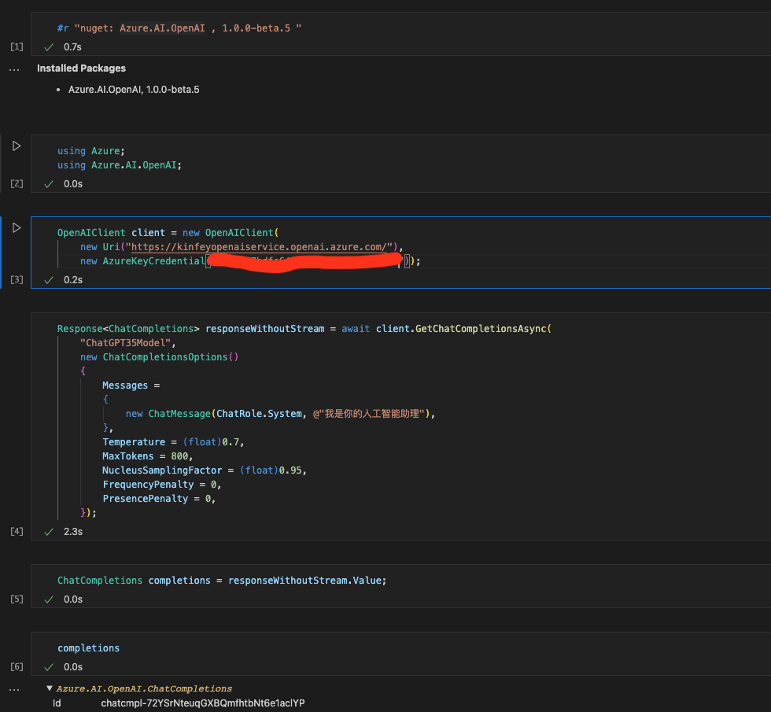


### **4.2 Semantic Kernel 面向 AI 编程的框架**

介绍一个微软最新的面向 AI 编程的开源框架 - Semantic Kernel (https://github.com/microsoft/semantic-kernel) 。生成式人工智能诞生后，从告诉机器要怎么做转变为告诉机器必须要做什么，这就降低了对于编码的依赖。例如翻译、归纳、总结再不用做具体算法了，只需要用简单的提示语，AI 就可以帮你完成。那就是说我们需要做的是写 Prompt 触发人工智能做事，这也是为什么现在 Prompt 工程人员这么值钱的原因。

Prompt 的内容涵盖不同的场景，不同的任务，涉及到各式各样的工作流程。如何管理好这些 Prompt 让生成式 AI 能完成任务，这是大家所关注的。还有通过上下文对话作出不同的响应，让 AI 注入到对话流中也很重要。Semantic Kernel 就是用来管理和解决上下文对话以及各种技能的框架。

Semantic Kernel 是面向 AI 编程的最佳方案，可以结合不同场景、综合技能和意图，支持多语言开发的框架。.NET 开发者可以通过 Semantic Kernel，更高效地使用生成式 AI 进行应用开发。本书会基于 SK 来展开，让大家在学习 Azure OpenAI 的过程中，同时学习 Semantic Kernel 相关知识。


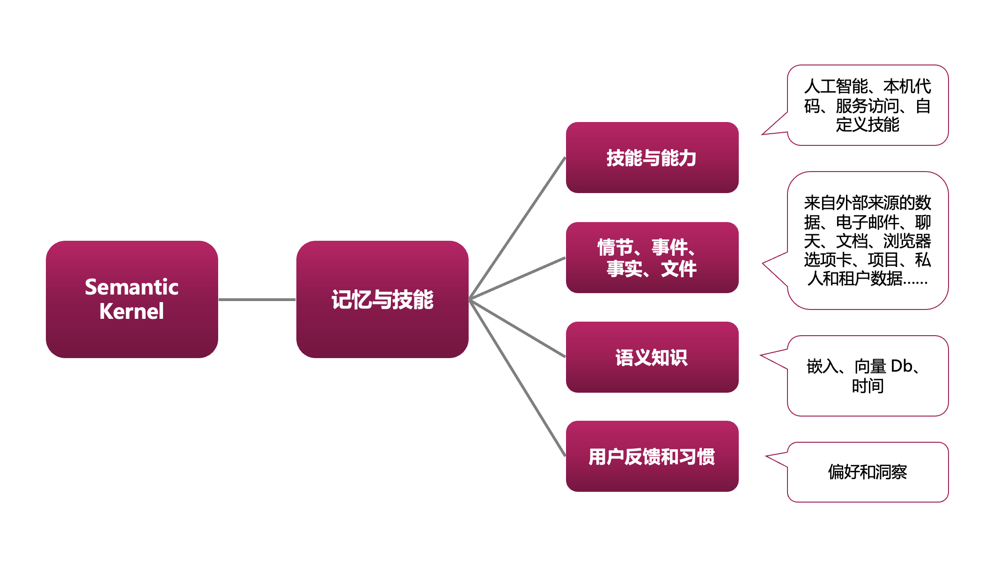


## **本章小结**

本章作为前言部分，主要介绍了 Azure OpenAI Service 的相关功能，以及针对 .NET 开发者的 SDK。希望以此作为 AI 开发者入门的第一步。


### **相关资料**

1. 免费 Azure 申请 https://azure.com/free
2. Azure for Student 申请（需要 edu 邮箱）https://aka.ms/studentgetazure
3. Azure OpenAI Service 申请 https://aka.ms/oaiapply
4. 关于 Semantic Kernel https://github.com/microsoft/semantic-kernel


