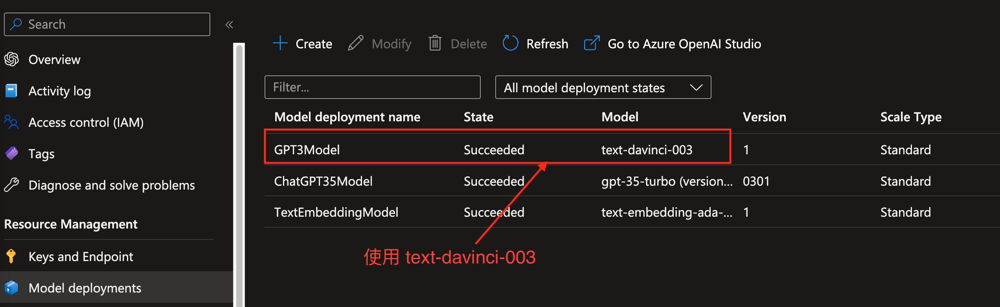
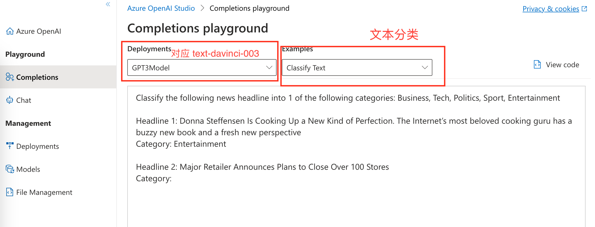
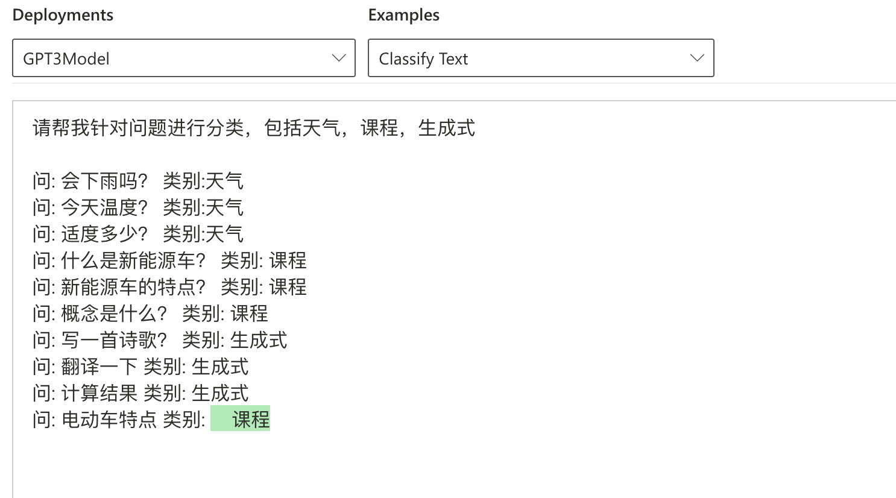
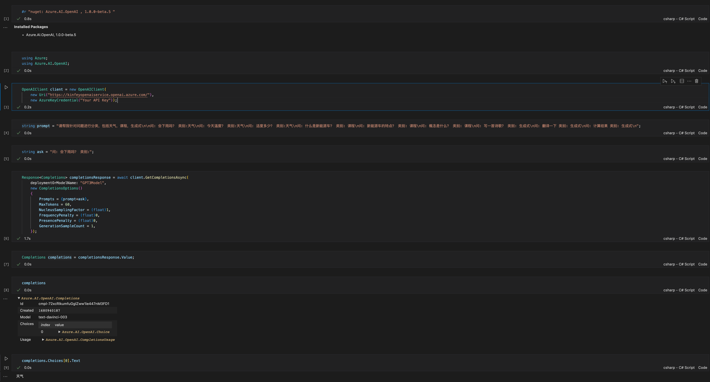

# **第一章. 问题分类**

我会把问题设定放在首位，也就是我们的第一章。毕竟所有生成式的 AI 都是需要基于问题给出答案。所以我一直不认同人工智能会取代人类，没有人类哪来问题呢？

ChatGPT 的神奇之处在于它可以根据你的问题去完成不同的工作，如归纳、翻译、分类等。我们的问题多种多样，除了问日常生活、通用知识外，还会遇到不同的时效性的问题和针对特定行业的问题。这个时候交给 ChatGPT ，你往往会发现有时候它在胡说八道。这个时候我们需要去纠正这些错误。你可以用 Prompt 提示语，去设定一些规则让 ChatGPT 回答 “不太清楚”，“没法解答”，“我在努力学习”……等等。这也是 Prompt 工程师工作的关键。其实在我们早期的对话机器人里，就有非常多针对实时问题和行业专有问题的解答。也许我们可以把这些语料重新添加到我们的 GPT 模型，让它变得更强大。也许把问题分类是一个最根本的做法。

举个例子，我们用了 OpenAI 的 davinci-03 模型去解答 “今天天气”，你会没法找到答案。也许你会说 ChatGPT 很笨，但实际上在 API 主导的年代，这不是一个困难的事情。

对问题进行分类，我们有两种方式。通过机器学习进行问题的分类是我们过往经常用的，除了分类外，还可以快速地提取不同的语义实体，基于问题进行更细致的划分，找到更符合的答案。现在还可以基于 OpenAI 去完成分类，这对于不熟悉机器学习的人来说是较好的选择。

## **一. 通过 ML.NET 对问题进行分类**

针对 .NET 我们有很好的 Machine Learning 工具 ML.NET 。通过 ML.NET 你可以快速对文本进行分类。

通过 ML.NET 你可以快速地完成相关问题的分类。 请参考 ./Code/01.HowToQuestionClassification/cn/MLdotNETTextClassification.ipynb

注意几个问题：

1. ML.NET 2.x 虽然支持了 NLP 的文本分类，但是现阶段还不支持中文，所以我用到 Jieba ，如果你是用英语的话，可以直接采用 BERT 来完成。

2. 在 Notebook 没办法加载 ML.NET 生成的模型，只能在传统程序中调用。

3. 现在没办法转换为 ONNX 。


## **二. 通过 Azure OpenAI Service 对问题进行分类**

你也可以通过 Azure OpenAI Service 对问题进行分类，这是更多开发者希望见到的，也是最傻瓜的方法。

打开 Azure Portal ，进入创建好的 Azure OpenAI Service ， 选择 davinci-003 部署：



部署成功后，进入 Azure OpenAI Studio ，打开 Playground ， 选择刚才创建的 davinci-003 - GPT3Model ，并选择文本分类：



修改 Prompt ：


```txt

请帮我针对问题进行分类，包括天气，课程，生成式

问: 会下雨吗？ 类别:天气
问: 今天温度？ 类别:天气
问: 适度多少？ 类别:天气
问: 什么是新能源车？ 类别: 课程
问: 新能源车的特点？ 类别: 课程
问: 概念是什么？ 类别: 课程
问: 写一首诗歌？ 类别: 生成式
问: 翻译一下 类别: 生成式
问: 计算结果 类别: 生成式
问: 电动车特点 类别: 

```

测试：



选择 C# 拷贝代码，打开 Visual Studio Code ，创建 ./Code/01.HowToQuestionClassification/cn/AzureOpenAITextClassification.ipynb 



具体请查看 ./Code/01.HowToQuestionClassification/cn/AzureOpenAITextClassification.ipynb


## **三. 传统机器学习文本分类和 Azure OpenAI Service 文本分类对比**

传统机器学习的文本分类优势是模型可以离线使用，但语料不足的情况下，难以获得准确的分类结果，而且技术要求较高。如果你处在需要隔离内部和外部业务数据的场景，可以选择传统机器学习文本分类。而 Azure OpenAI Service 可以在 Prompt 上设置少量样例来完成分类，但比较依赖网络。现在是网络通行的年代，Azure OpenAI Service 有更高的价值。而且 Azure OpenAI Service 的成本还非常低。请记住一句话，场景很重要，但 Azure OpenAI Service 并不是让你抛弃原有的技术。你需要结合众多的人工智能知识来打造智能化的解决方案。

## **四. 用 Semantic Kernel 来做文本分类**

OpenAI 是新物种，很多人希望除了能通过 Azure OpenAI Service 访问到 API 完成企业级的应用外，更希望能有一个好的架构来管理好基于 OpenAI 的项目。如果单纯从 REST 的角度看，作为 .NET 开发者已经熟能生巧。但实际上如果你深入了解 OpenAI 的应用，你会发现基于 OpenAI 的应用更多的集中在进行 Prompt 管理上。这与我们传统意义上的架构有所不同。首先它不在以代码为主导，更多是以 Prompt 为代表的文本。你可以通过 Prompt 去描述一段要求，让 OpenAI 完成。当我们希望结合 OpenAI 来构建智能系统的时候就会发现，我们需要非常多的 Prompt 来完成不同的业务。如何去管理 Prompt ，以及如何优化好我们不同业务流的智能化工作，是架构一个好的 OpenAI 所必需的。综上所述，Senmantic Kernel 是帮我们管理各式各样 Prompt (也就是 Skill )的框架。也许我们可以先用 Senmantic Kernel 来做一个文本分类来进行学习。

要使用 Senmantic Kernel ，我们需要引入 .NET Senmantic Kernel 的库，我们先创建一个 SKTextClassification.ipynb，接下来操作如下：


1. 创建一行 Cell ， 引入 Microsoft.SemanticKernel 的 .NET 库：


```csharp

#r "nuget: Microsoft.SemanticKernel, *-*"

```

2. 引入 Microsoft.SemanticKernel 的命名空间：


```csharp

using Microsoft.SemanticKernel;
using Microsoft.SemanticKernel.SemanticFunctions;

```

3. 创建 SK 内核实例：

```csharp


IKernel kernel = Kernel.Builder.Build();

```

Semantic Kernel (SK) 中的内核是用户问题的编排器。内核结合技能，内存和连接器来实现用户的智能化预期，除了配置基本的 Azure OpenAI / OpenAI 的基本链接串/模型/参数外，还可以基于用户的要求配对相关技能，整合技能形成工作流等。

接下里添加信息，添加和 Azure OpenAI Service 相关的信息：


```csharp

kernel.Config.AddAzureOpenAITextCompletionService(
    "GPT3",      
    "text-davinci-003",                  
    "Your Endpoint",    
    "Your Key"          
);

```

4. 设置和文本分类相关的 Prompt ：


```csharp

string skPrompt = """

请帮我把 {{$input}} 进行类别确认，类别包括天气，课程，生成式，如果不太清楚，请回答没法确认，分类参考如下：

问: 会下雨吗？ 类别:天气
问: 今天温度？ 类别:天气
问: 适度多少？ 类别:天气
问: 什么是新能源车？ 类别: 课程
问: 电动车的特点 类别: 课程
问: 概念是什么？ 类别: 课程
问: 课程相关的内容有哪些？ 类别: 课程
问: 写一首诗歌？ 类别: 生成式
问: 翻译一下 类别: 生成式
问: 计算结果 类别: 生成式

如果能确认类别，天气相关请只输出 1 ， 课程相关请只输出 2 ， 生成式相关请只输出 3 ，没法确认相关请只输出 0，并把{{$input}}和它的类别参考以下 json 格式输出

{""question"":""{{$input}}"",""label"":""{{$label}}""}

""";

```

Prompt 是非常非常重要的，对于生成式 AI 来说，有一个好的 Prompt 事半功倍。如何写 Prompt，网上有不同的方式，建议大家查阅。我总觉得文科生比理科生更容易做 OpenAI 的项目。

5. 和模型相关的配置：


```csharp

var promptConfig = new PromptTemplateConfig
{
    Completion =
    {
		MaxTokens = 60,
		FrequencyPenalty = (float)0,
		PresencePenalty = (float)0
    }
};

var promptTemplate = new PromptTemplate(
    skPrompt,                        
    promptConfig,                    
    kernel                           
);


```

PromptTemplateConfig 就是设定我们对应模型的参数，你可以基于你所使用的模型进行调整，这里我参照了通过 Playground 引用的参数。至于 PromptTemplate 这里面就是整合了我们创建的 kernel 、prompt 以及模型参数。告诉计算机是该内核使用 Azure OpenAI Service 的 text-davinci-003 模型，prompt（skill）以及相关模型参数。

6. 创建一个 SemanticFunctionConfig，绑定 promptConfig 。 promptTemplate，为内核添加一个具备文本分类功能的函数做准备：


```csharp

var functionConfig = new SemanticFunctionConfig(promptConfig, promptTemplate);

```

7. 通过内核注册技能和能力：


```csharp


var classificationFunction = kernel.RegisterSemanticFunction("TextSkill", "TextClassification", functionConfig);

```

大家知道一个 OpenAI 的项目具备多个技能吗？而多个技能具备不同的能力。在 SK 你可以通过代码去描述技能和它具备的能力，以及相关参数设置，也可以通过文件夹的方式去描述（通过文件夹方式，会在下一章介绍）。

8. 现在你可以设置输入来尝试看看是否能满足要求：


```csharp

var input = """
今天广州天气怎么样？
""";

var classification = await kernel.RunAsync(input, classificationFunction);

Console.WriteLine(classification);


```

根据 Prompt 的要求，我要对问题分类，然后以 json 格式输出，结果还是令人满意的：


```json

{"question": "今天广州天气怎么样？", "label": "1"}

```

**注意**： 示例代码在 ./Code/01.HowToQuestionClassification/cn/SKTextClassification.ipynb


## **本章小结**

本章正式进入 Azure OpenAI Service 的应用学习，基于文本分类，我们用传统的 ML.NET , Azure OpenAI .NET SDK , 以及 Semantic Kernel .NET SDK 三种方法完成了相关的操作。对于开发者来说，可以体验基于传统的机器学习方式以及人工智能方式来完成文本分类的任务。希望大家能有所收获，期待你继续了解下一章的内容。

## **相关资料**

1. 关于 ML.NET https://dotnet.microsoft.com/en-us/apps/machinelearning-ai/ml-dotnet
1. 关于 Semantic Kernel https://github.com/microsoft/semantic-kernel


