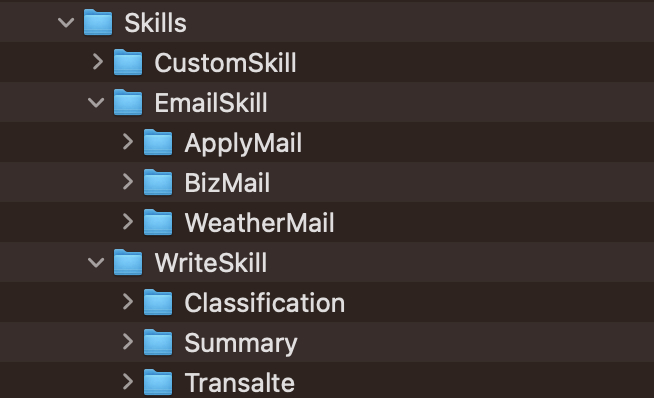
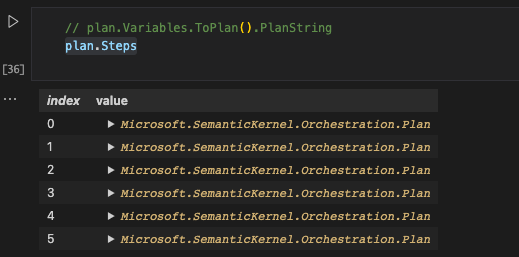

# **第二章. 技能使用大全**

使用生成式 AI 的时候，我们需要预先定下一些规则，这些规则可以包括回答的格式，语气，角色，或者业务相关的内容。这些规则，在生成式 AI 中我们称之为 Prompt 。生成式 AI 兴起后 ，写 Prompt 的工程师非常吃香，通过 Prompt 引导 AI 生成需要的答案。本章中我们希望让大家掌握不同类型的 Prompt 的使用技巧以及通过 Semantic Kernel 管理好 Prompt。

## **2.1 技能介绍**

在日常生活中需要完成某一方面专业的工作，必须有某一方面的能力。生成式 AI 是人工智能的进化，是完整的百科全书。你可以把它看作是一个人脑。写 Prompt 的时候实际上就是触发它使用各式各样的技能。例如读写，例如翻译，例如总结，例如管理等。可是在融入到行业的业务的场景时，这些技能就必须得到细化，例如写的技能，在行业应用中，就包括了归纳总结，文案输出，公文生成等与业务场景贴近的内容。而这些能力的整合就是一项技能，一个行业的应用需要具备各种技能。这些技能各式各样，除了生成式 AI 具备的技能外，我们还有行业专有的技能。下面来归纳一下

### **2.1.1 常规能力**

通过简单描述就可以达到的常规能力，例如翻译，总结，或者提取内容都是生成式 AI 的拿手好戏。我们可以通过简单文字描述就可以完成，例如

“通过输入的内容，总结出100个字的内容，并且翻译成英文”

“帮我用诗词赞美一下广州”

“介绍煮 {{$input}} 的方法”

这些都是生成式 AI 模型带来的能力。写好 Prompt 描述好你需要的能力是很重要的，或者一个非计算机专业的学生比计算机专业的学生更适合做这个事情

### **2.1.2 时效性能力**

生成式 AI 最大问题是时效性缺失，当然现在 GPT-4 也开始具备，但都是有限的。对于一些日常，新闻，政策，查询实时天气等都是时效性的问题。我们需要结合搜索引擎，以及企业内部数据库来配合赋予生成式 AI 时效性的能力

### **2.1.3 专业性能力**

对于不同行业想用好生成式 AI，除了利用好强大的知识能力外，也需要结合行业内容来补充。例如问新员工的相关内容，GPT 模型就没有一个准确的答案，因为这个是每个企业唯一的。我们需要为好生成式 AI 添加额外的知识，这个时候更好的就是用回我们原有的知识例如非结构化数据的搜索，或者依赖于企业内部数据库的调用。这些都是我们必须要完成的。我们可以引入我们过往人工智能技术的专业性知识。例如，非结构化的文档数据 / 存储在数据库的业务数据 / 相关业务流程 BI 数据 等。

## **2.2 Semantic Kernel 语义内核管理你的技能**

Semantic Kernel (简称 SK) 为我们提供了非常好的技能管理功能，开发者能针对业务通过 SK 更好组织不同的技能让生成式 AI 可以完成企业级的任务。

### **2.2.1 SK 的重要概念**

**Skills-技能**

技能 - 生成式 AI 应用，都离不开技能，你可以理解为要让生成式 AI 完成任务提供的一些能力的组合。每一个任务可以有多个能力，例如文书的技巧就可以有写作，归纳，总结，修改等相关能力，一个技能下面可以有不同的能力。在 SK 中通过文件夹来管理不同的技能，一个技能就包含不同的能力。

在 SK 中定义技能是非常简单的，通过文件夹就可以定义不同的技能。每个技能下可以创建不同的子文件夹设定能力，如图所示：



我们有一个技能集的文件夹叫 Skills，里面有不同的技能，包括**CustomSkill** - 自定义技能，**EmailSkill** - 电子邮件技能，**WriteSkill** - 书写技能，通过子文件夹中表示。

每个技能都包含有不同的能力，都放在不同技能的子文件夹下

**CustomSkill** - 自定义技能(我们会在函数/方法中讨论)

**EmailSkill** - 电子邮件技能有申请相关的邮件 ApplyMail ，有商业相关的邮件 BizMail ，也有天气相关的邮件 WeatherMail的能力 

**WriteSkill** - 书写技能有文本分类 Classification，归纳 Summary，翻译 Translate 等能力

而每个能力都有一个 Prompt 和对应的配置来描述，如我需要书写技能的分类能力，就包含一个 skprompt.txt 和 config.json (这是固定的格式，skprompt.txt 就是我们对应能力的 Prompt , config.json 就是 OpenAI 模型的参数)。

如分类的 Prompt ，我的 skprompt.txt 描述是这样的

```txt

请帮我把 {{$input}} 进行类别确认，类别包括天气，课程，生成式，如果不太清楚，请回答没法确认，分类参考如下：

问: 会下雨吗？ 类别:天气
问: 今天温度？ 类别:天气
问: 适度多少？ 类别:天气
问: 什么是新能源车？ 类别: 课程
问: 电动车的特点 类别: 课程
问: 概念是什么？ 类别: 课程
问: 课程相关的内容有哪些？ 类别: 课程
问: 写一首诗歌？ 类别: 生成式
问: 翻译一下 类别: 生成式
问: 计算结果 类别: 生成式

如果能确认类别，天气相关请只输出 1 ， 课程相关请只输出 2 ， 生成式相关请只输出 3 ，没法确认相关请只输出 0，并把{{$input}}和它的类别参考以下 json 格式输出

{""question"":""{{$input}}"",""label"":""{{$label}}""}


```

而模型设置参数对应 config.json


```json

{
    "schema": 1,
    "type": "completion",
    "description": "文本分类",
    "completion": {
      "max_tokens": 60,
      "presence_penalty": 0.0,
      "frequency_penalty": 0.0
    }
}

```

如果我们希望通过 Semantic Kernel 去调用文书技能的文本分类能力, 只需要通过 kernel.ImportSemanticSkillFromDirectory 引入技能集和相应技能（Semantic Kernel 的定义请回看第一章）, 然后直接根据需要的能力调用就可以了(别忘记引入 Microsoft.SemanticKernel.KernelExtensions)，代码如下


```csharp

var skillsDirectory =  System.IO.Directory.GetCurrentDirectory() + "/Skills";

var write_skill = kernel.ImportSemanticSkillFromDirectory(skillsDirectory,"WriteSkill");

var questionLabel = await kernel.RunAsync("今天天气好吗", write_skill["Classification"]);

```

如果你想了解更多请参考 ./Code/02.AddSkill/ImportNativeFunctionSkill.ipynb

**Fucntions-函数/方法**

我们通过函数去封装不同技能下的能力，把函数分成两种：

**语意技能函数** - 通过封装 Prompt 提示语和模型设置来定义函数，这在第一章也已经提及我在这里就不多提了

**原生技能函数** - 用于结合时效性技能和业务技能的函数封装，可以非常快速地定义不同的技能，如我需要查询一些入职相关的内容以及实时天气状况我们都可以通过原生函数定义这些技能赋予给系统答案，再让生成式 AI 完成下一步的工作，这是我们定义原生技能函数的一个例子

```csharp

using Microsoft.SemanticKernel.SkillDefinition;
using Microsoft.SemanticKernel.Orchestration;
public class CompanySearchSkill
{
    [SKFunction("search employee infomation")]
    public string EmployeeSearch(string input)
    {
        return "欢迎了解社保相关内容";
    }

    [SKFunction("search weather")]
    public string WeatherSearch(string text)
    {
        return "欢迎搜索天气";
    }
}

```

通过 SKFunction 定义能力，提供定制化的技能是每个企业应用所必须的，我们通过这个内容可以增强应用的专业性。调用也是非常简单


```csharp

CompanySearchSkill companySearchSkill = new CompanySearchSkill();

var customSkill = kernel.ImportSkill (companySearchSkill, "CompanySearchSkill");

```

通过创建实例后，直接像其他技能一样引入就可以了，你可以理解为是用函数封装好的技能集。之后调用就可以根据问题去绑定不同的技能就可以了

```csharp

var weatherOutput = await kernel.RunAsync("天气",customSkill["WeatherSearch"]);

var employeeOutput = await kernel.RunAsync("社保如何购买",customSkill["EmployeeSearch"]);


```

如果你想了解更多请参考 ./Code/02.AddSkill/ImportNativeFunctionSkill.ipynb


**SequentialPlanner-有序计划**

如何判断完成一个事情，是需要按照一系列的有序计划来制定的。例如有一个任务“查找广州天气，把结果翻译成中文后根据天气情况生成穿衣提示，并结合天气结果和穿衣提示写一封邮件”。要完成这个任务，我们需要具备四个技能第一查找天气，第二翻译，第三生成穿衣提示，四就是写一封邮件。对于发出任务的人，需要明确指出每一步的工作，而对于开发者需要为完成这个任务提供能力。

在 Semantic Kernel 中，就有 SequentialPlanner，让我们能根据目标，动态帮我们任务按顺序设定执行任务并配对好技能。我们赋予给 kernel 很多的技能， SequentialPlanner 可以根据我们需要完成的目标去配对不同的能力帮我们完成各种任务，定义 SequentialPlanner 非常简单


```csharp

var planner = new SequentialPlanner(kernel);

```

通过输入目标来制定执行的顺序


```csharp

var plan = await planner.CreatePlanAsync("查找广州天气把结果翻译成中文后根据天气情况生成穿衣提示，并结合天气结果和穿衣提示写一封邮件");

```

通过 


```csharp

plan.Steps

```

可以非常清晰地看到要完成“查找广州天气，把结果翻译成中文后根据天气情况生成穿衣提示，并结合天气结果和穿衣提示写一封邮件”所需要的每一步的技能



这也是一个工作的流程，针对一些复杂的任务，我们可以完成更多综合性的工作。以下是执行的逻辑代码


```csharp

var result = await kernel.RunAsync(plan);

result.Result


```

如果你想了解更多请参考 ./Code/02.AddSkill/ImportPlanSkill.ipynb

## **2.3 本章小结**

用好 Prompt 给到生成式 AI 能给到准确的答案。管理好 Prompt 的集合对于企业是非常重要的。通过 Semantic Kernel 我们可以快速地完成各种 Prompt 的整合，通过本章你可以学习管理不同的 Prompt，完成不同的企业流程。

### **相关资料**

1. 关于 Semantic Kernel https://github.com/microsoft/semantic-kernel


