# **第三章. 结合 Azure AI 拓展你的技能**

在前两章，我们学会了如何连接 Azure OpenAI Service , 也认识了如何通过 Semantic Kernel 管理和组织不同的技能。生成式 AI 的出现，让人工智能真正具备了“智”的能力，基于不同的 Prompt 来给出答案。那么这些答案能满足行业的需要吗？例如我们需要让生成式 AI 提供新员工入职的注意事项， 这个时候生成式 AI 给出的往往是一些错误的答案，因为生成式 AI 并没有你所在企业的员工手册。又例如我们问实时的新闻、我们问 ChatGPT：OpenAI 是否支持插件开发？ 它也会给出错误的答案。那么我们可以通过什么方法去组织语料来为生成式 AI 提供一些事实依据，从而做到符合真实的解答呢？本章希望通过 Azure 原有的 AI 能力结合 OpenAI 构建人工智能应用来提供解决方案。

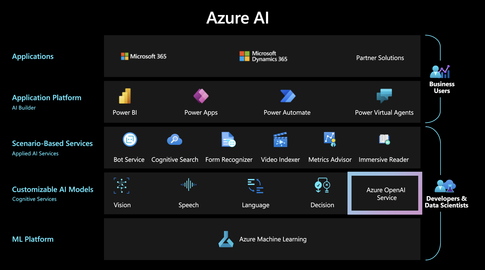

Azure AI 有非常强大的人工智能功能，面向不同程度的人群，从开发层面有面向专业人工智能的科学家的 Azure 机器学习服务，有面向非专业人工智能开发人员的 Azure 认知服务，也有面向应用场景的聊天机器人，认知服务搜索，视频索引等，也有从商业应用的商业解决方案 Office 365 , Dynamics 365 ，以及低代码解决方案 Power Apps , Power BI , Power Automate 等。如果你希望打造基于云原生的人工智能企业级方案 Azure AI 绝对是一个最顶级的解决方案。

## **3.1 认识 Azure 认知服务**


Azure 认知服务 (https://azure.microsoft.com/zh-cn/products/cognitive-services/) 使每个开发人员和数据科学家都能接触到 AI。借助领先模型，可以解锁各种用例。只需进行 API 调用，即可将查看、收听、朗读、搜索、理解和加速高级决策的功能嵌入到应用中。让所有技能级别的开发人员和数据科学家都能够轻松地向其应用添加 AI 功能。


在 Azure 上有不同的认知服务，主要集中在视觉和语音，语言，例如涉及语言内容的文本，知识，搜索以及实体提取都有，涉及视觉部分的分类，物体识别，还有语音部分的语音转文字，文字转语音的部分。

使用认知服务，你可以很快速地使用微软已有模型进行开发，直接完成应用场景。特别当你的团队缺少机器学习 / 深度学习的工程师是相当有用的。

有人会说生成式 AI 的出现，直接取代了认知服务，实际上他们是可以互补的。我们可以结合 Azure 认知服务，完成多场景的人工智能应用。 Azure OpenAI Service 已经添加进 Azure 认知服务中，结合微软不同的 AI 产品，可以打造一个完全 AI 的解决方案。

### **3.1.1 开通 Azure 认知服务**

使用 Azure 认识服务很简单，以下是相关步骤

1. 你必须有 Azure 账号(如果你没有 Azure 账号可以通过 https://azure.com/free 注册，如果你是学生可以通过 https://aka.ms/studentgetazure 免信用卡注册)

2. 打开你的 Azure 门户，创建资源，点击 AI + Machine Learning 选择 Azure Cognitive Service

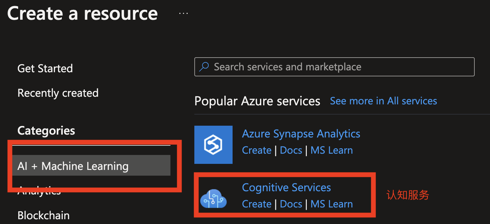

3. 选择订阅并填写资源组，名字以及所在区域，就可以直接创建了

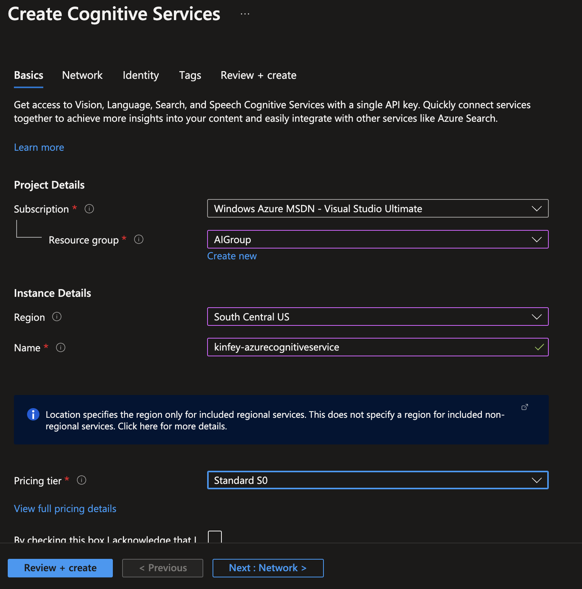

注意：Azure 认识服务是一个综合服务，你可以通过该服务完成视觉，语言，文本，决策等不同的功能，你也可以在 Azure 创建单一场景的认知服务，如

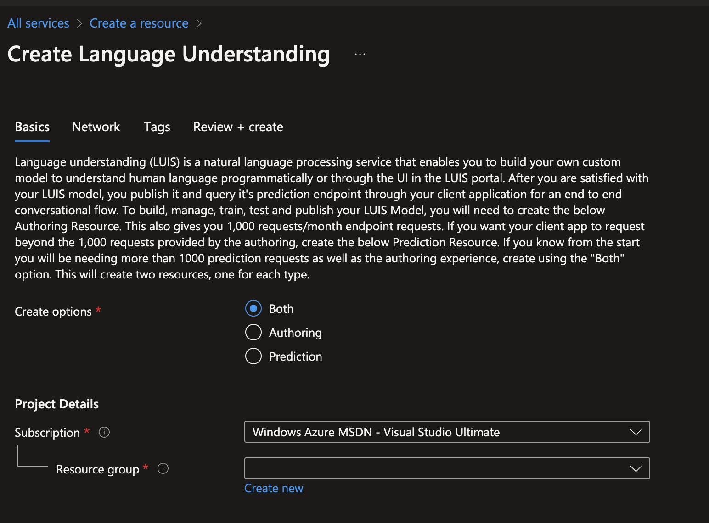


### **3.1.2 在 .NET 中使用 Azure 认知服务**

Azure 认知服务通过 REST API 给到不同的编程语言调用。对于 .NET ，你可以使用不同场景的 SDK 或者通过 HttpClient 直接调用来使用不同功能的认知服务。

如我需要使用文本服务，检测文本的语言，就可以通过认知服务的 .NET SDK  Azure.AI.TextAnalytics 去调用，步骤如下：

1. 创建一个 .ipynb 的 Notebook 文件


```bash

#r "nuget: Azure.AI.TextAnalytics"

```

2。 引入相关的命名空间

```csharp

using Azure;
using System;
using Azure.AI.TextAnalytics;
using System.Collections.Generic;

```

3. 获取 Azure 认知服务的 Key 和 Endpoint

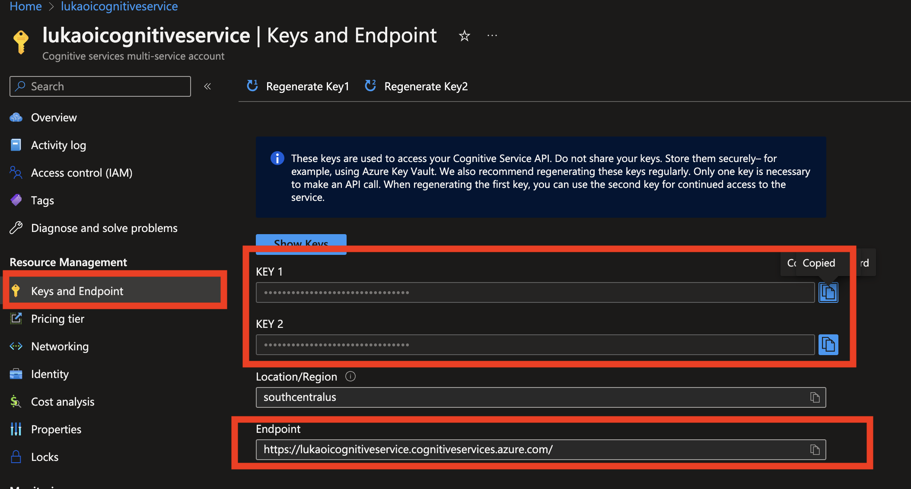

4. 用变量设置 Key 和 Endpoint 

```csharp

string endpoint = "Your Endpoint";
string apiKey = "Your API Key";

```

5. 创建 TextAnalyticsClient 对象，绑定

```csharp

var client = new TextAnalyticsClient(new Uri(endpoint), new AzureKeyCredential(apiKey));

```

6. 加入字符串


```csharp

string document =
    "Este documento está escrito en un lenguaje diferente al inglés. Su objectivo es demostrar cómo"
    + " invocar el método de Detección de Lenguaje del servicio de Text Analytics en Microsoft Azure."
    + " También muestra cómo acceder a la información retornada por el servicio. Esta funcionalidad es"
    + " útil para los sistemas de contenido que recopilan texto arbitrario, donde el lenguaje no se conoce"
    + " de antemano. Puede usarse para detectar una amplia gama de lenguajes, variantes, dialectos y"
    + " algunos idiomas regionales o culturales.";


```

7. 完成相关判断函数的调用


```csharp

Response<DetectedLanguage> response = client.DetectLanguage(document);
DetectedLanguage language = response.Value;

```

8. 查看结果
   
```csharp

language.Name

```

具体执行你可以参考 [../Code/03.ImportAzureAI/AzureCognitiveServiceForText.ipynb](../Code/03.ImportAzureAI/AzureCognitiveServiceForText.ipynb)

## **3.2 必应搜索的检索能力**

你有在用必应搜索吗？ 通过必应可以搜索不同的新闻资料，图片，视频，文档等内容。通过 Azure 可以使用必应搜索的 API 。使用必应搜索 API，可以生成联网应用和服务，用于查找网页、图像、新闻、位置以及其他不含广告的内容。 通过使用必应搜索 REST API 或 SDK 发送搜索请求，可以获取 Web 搜索的相关信息和内容。在生成式 AI 的场景中，针对一些时效性的内容缺失，我们可以通过必应搜索 API 来提供数据。

你可以通过 Azure Portal 创建必应搜索的 API 服务 - Bing Search V7

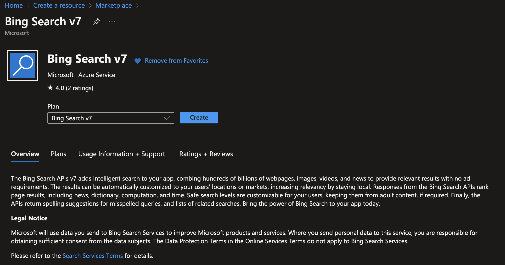

通过选择订阅，以及设定资源组，名字，以及价格，点击创建后就可以使用了

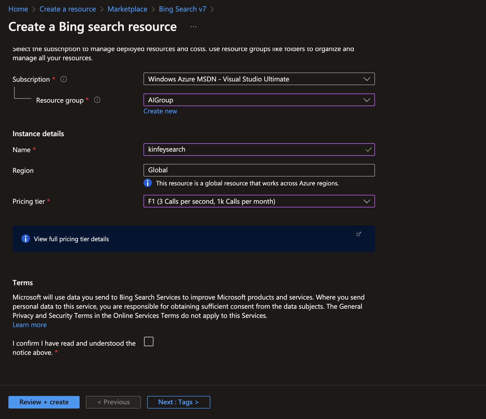

调用必应搜索的 API 非常简单，直接通过 HttpClient 调用 API 节点就可以了


具体执行你可以参考 [../Code/03.ImportAzureAI/BingForNews.ipynb](../Code/03.ImportAzureAI/BingForNews.ipynb)


## **3.3 利用 Azure Cognitive Search 管理非结构文档**

## **3.3.1 认识 Azure Cognitive Search**

Azure Cognitive Search（以前称为“Azure 搜索”）是一个云搜索服务，它为开发人员提供基础结构、API 和工具，用于基于 Web、移动和企业应用程序中的专用异类内容构建丰富的搜索体验。

搜索是将文本呈现给用户的应用的基础，其中常见的场景包括目录或文档搜索，在线零售应用程序，基于专属内容进行数据探索。 创建搜索服务时，将使用以下功能：

1. 一个搜索引擎，用于根据包含用户自有内容的搜索索引进行全文搜索
2. 丰富索引编制、词汇分析以及用于提取和转换内容的可选 AI 扩充
3. 用于文本搜索、模糊搜索、自动完成、地理搜索等的丰富查询语法
4. 通过 REST API 和 Azure SDK 中的客户端库实现的可编程性
5. 数据层、机器学习层和 AI（认知服务）级别的 Azure 集成

Azure Cognitive Search 对于非结构文档的搜索有非常好的效果，通过它可以引入更多的非结构化数据作为预料引入到生成式 AI 模型场景，构造一个企业级应用的生成式 AI 方案。

从体系结构方面来讲，搜索服务位于外部数据存储（包含未编入索引的数据）与客户端应用（向搜索索引发送查询请求并处理响应）之间。

在客户端应用中，搜索体验使用 Azure 认知搜索中的 API 定义，可能包括相关性调整、语义排名、自动完成、同义词匹配、模糊匹配、模式匹配、筛选和排序。

在整个 Azure 平台上，认知搜索可以以“索引器”（自动从 Azure 数据源引入/检索数据）和“技能组”（引入认知服务（例如图像和自然语言处理）中的可消耗 AI，或者引入你在 Azure 机器学习中创建的或在 Azure Functions 内包装的自定义 AI）的形式与其他 Azure 服务集成 。

如果你希望了解更多 Azure Cognitive Search 的搜索功能，可以查看 https://learn.microsoft.com/zh-cn/azure/search/ 


## **3.3.2 构建 Azure Cognitive Search**

开启 Azure Cognitive Search 的步骤相对之前的步骤比较复杂，我们可以把它分成两部分进行处理

**第一部分:** 在 Azure 上开启 Azure Cognitive Search 

1. 打开 Azure 门户，选择创建资源，选择 Azure Cognitive Search 进行创建

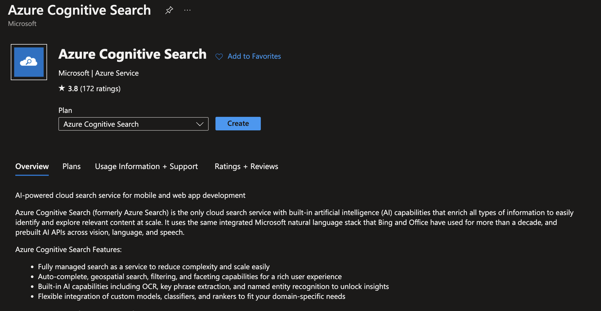

2. 选择 Azure 订阅，并选择资源组和创建文件名等，这里建议使用至少标准的价格模式，因为需要使用语义搜索这是最低配置

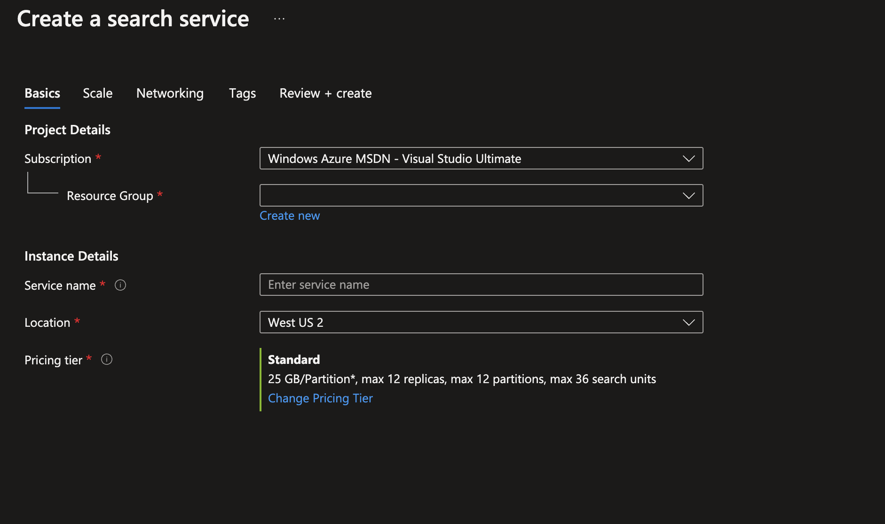


**第二部分:** 在 Azure Cognitive Search 构建一个非结构化文档搜索

通过 Azure Cognitive Search 可以检索我们的非结构化文档，但这个需要结合我们不同的 Azure 功能，包括 Azure Blob Storage和 Azure Cognitive Service。

1. 配置 Azure Blob Storage 

选择 Azure 门户，点击存储账户

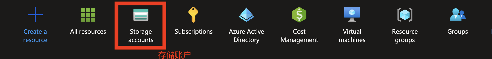

创建账户，除了资源组和名字，区域外，性能选择标准

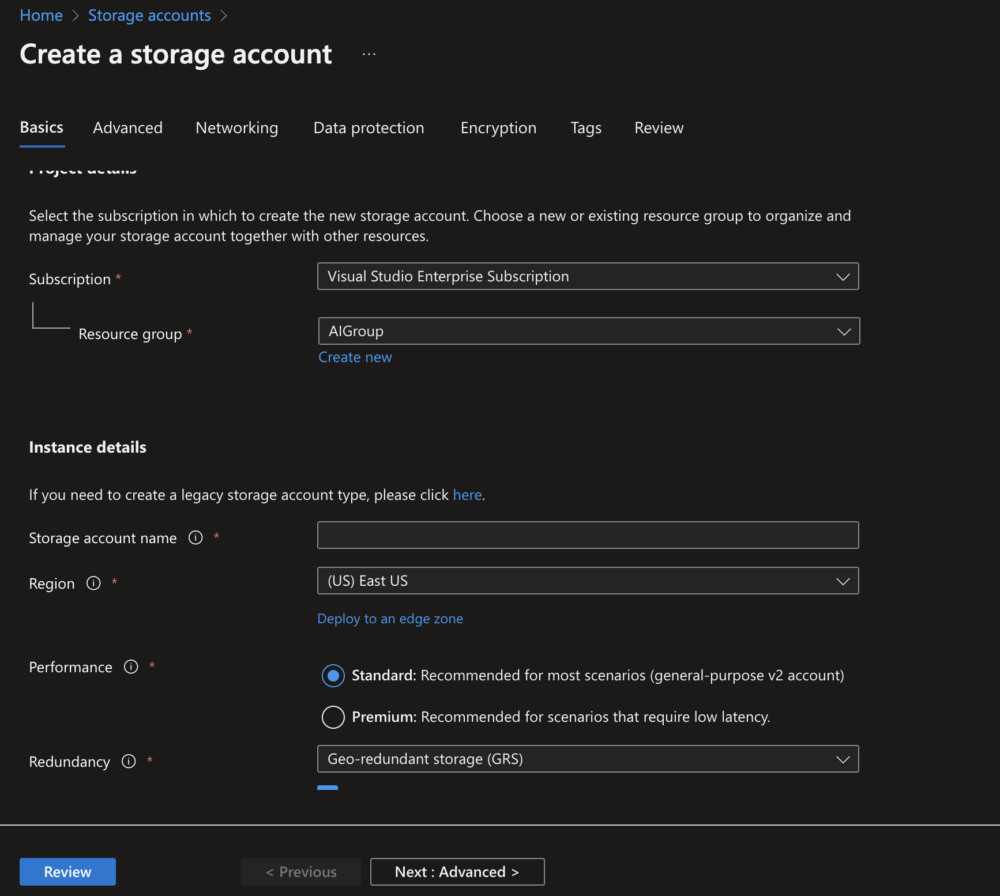

创建成功后，进入新创建的存储账户，选择容器

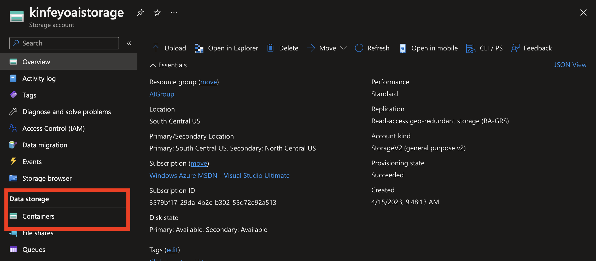

添加存储容器

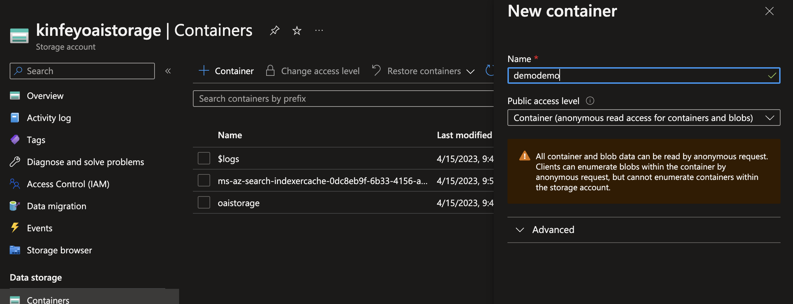

选择创建好的容器，上传 ./Code/03.ImportAzureAI/data 中的 pdf 文件到容器中

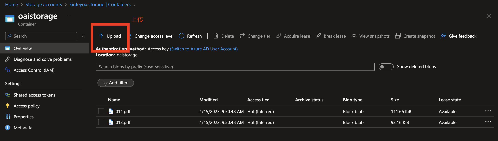


2. 配置 Azure Cognitive Service 请参考本章的 3.1.1 开通 Azure 认知服务

3. 在 Azure Cognitive Search 中选择导入数据，绑定 Azure Blob Storage 并设置索引

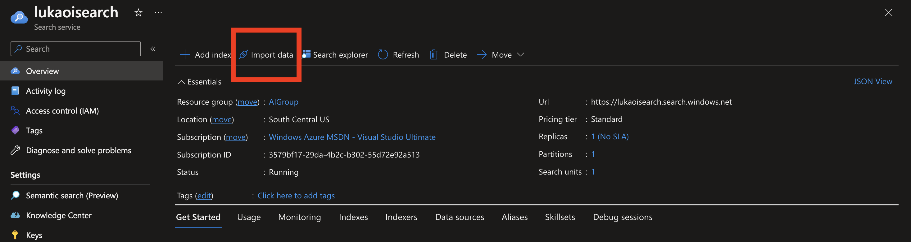

   选择存在数据，完成 Azure Blob Storage 绑定

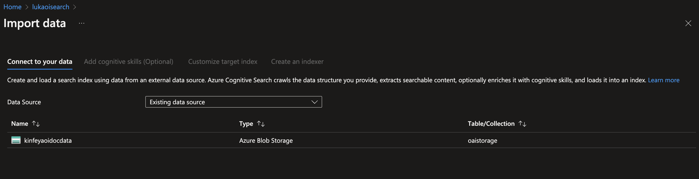

   注意: 因为需要设置语音搜索，所以必须绑定 Azure Cognitive Service 

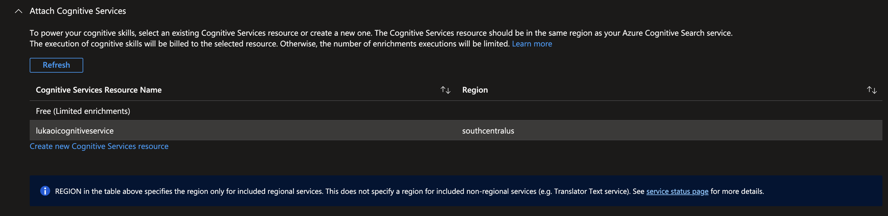

   设置搜索技能，具体字段设置如下，并设置名字

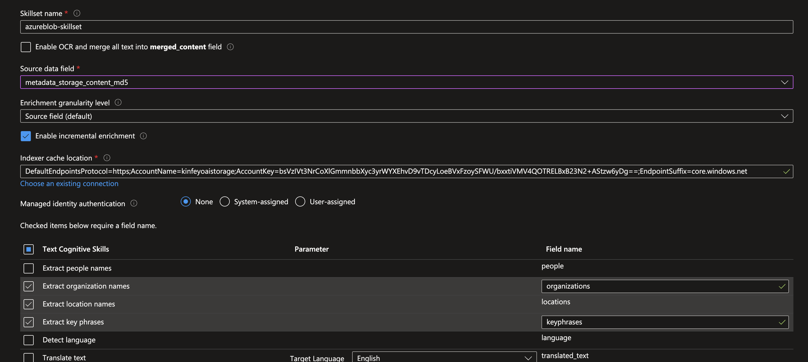

   索引设置如下

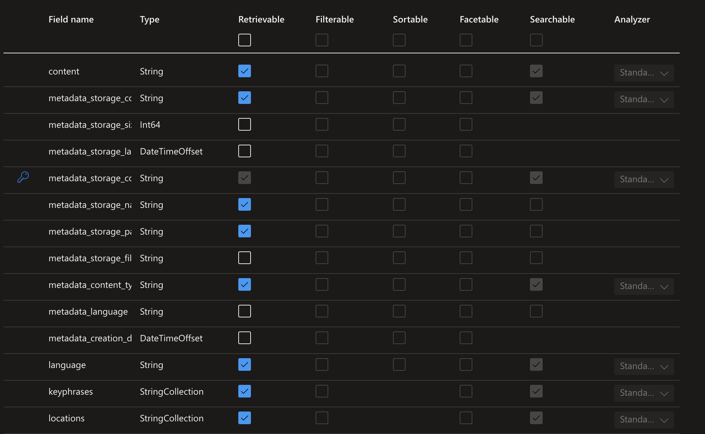

   
   完成后继续添加 indexer 的名字并创建即可


**注意：** 如果你希望有了解更多的内容，建议你参考该链接 https://learn.microsoft.com/zh-cn/azure/search/search-create-service-portal

   配置完成后在创建的 Azure Cognitive Service 添加 Semantic search  ，选择 Free 就可以了

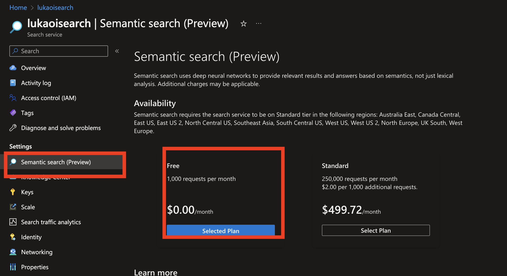


这样就配置好 Azure Cognitive Search 。


## **3.3.3 验证创建的 Azure Cognitive Search**

我们可以尝试验证刚创建好的 Azure Cognitive Search，步骤如下

1. 在 Azure Cognitive Search 中选择搜索浏览

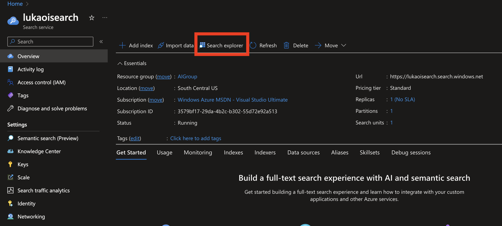

通过搜索浏览就可以测试检索的结果，并可设置一些相关的参数

2. 语义全文检索，需要配置一些相关内容，需要开启语义搜索

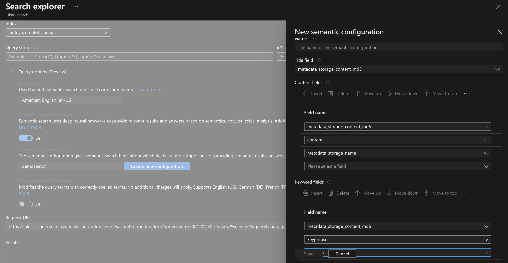

3. 我们可以做一些测试，例如，新能源车的发展

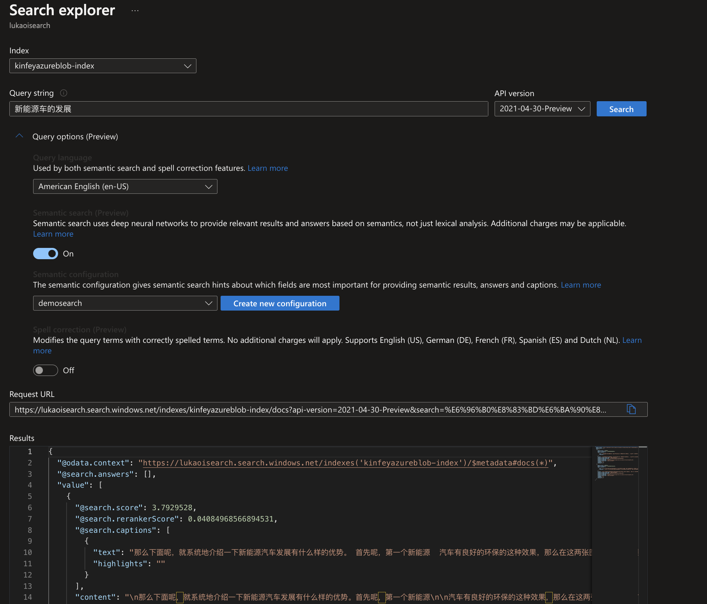


## **3.3.4 用 .NET 调用 Azure Cognitive Search**

你可以参考 [../Code/03.ImportAzureAI/AzureCognitiveSearchDemo.ipynb](../Code/03.ImportAzureAI/AzureCognitiveSearchDemo.ipynb) 来了解具体的实现情况


## **3.4 本章小结**

在生成式 AI 风行的年代，原有的 AI 技术不是被取代，而是会继续沿用补充生成式 AI 的不足。 通过云原生的 AI 技术，可以整合更多的场景。本章为大家介绍了在 Azure 上的 AI 技术，希望大家可以结合生成式的 AI 完成更专业的行业应用。

### **相关资料**

1. 关于 Azure Cognitive Services https://learn.microsoft.com/en-us/azure/cognitive-services/

2. 关于 Azure Bing Search API https://learn.microsoft.com/en-us/azure/cognitive-services/bing-web-search/

3. 关于 Azure Cognitive Search https://learn.microsoft.com/zh-cn/azure/search/ 


   


   

   
  

 


