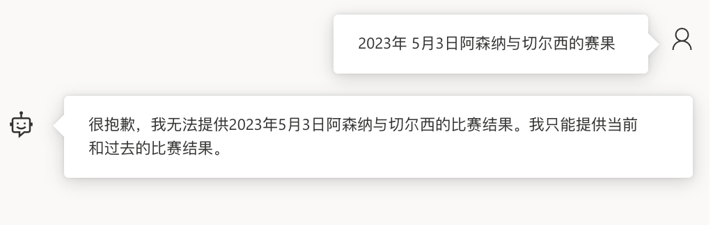
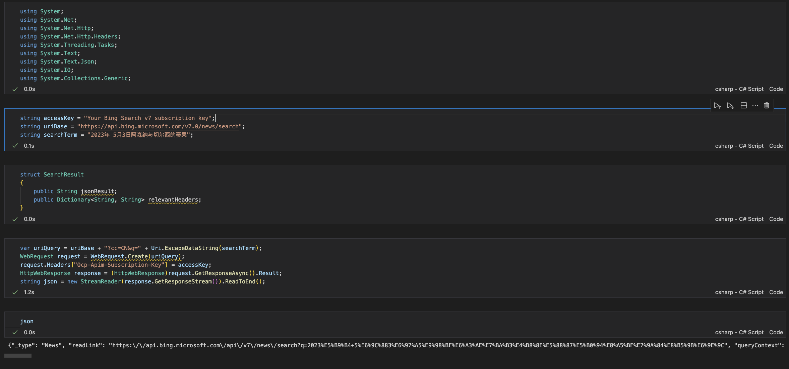
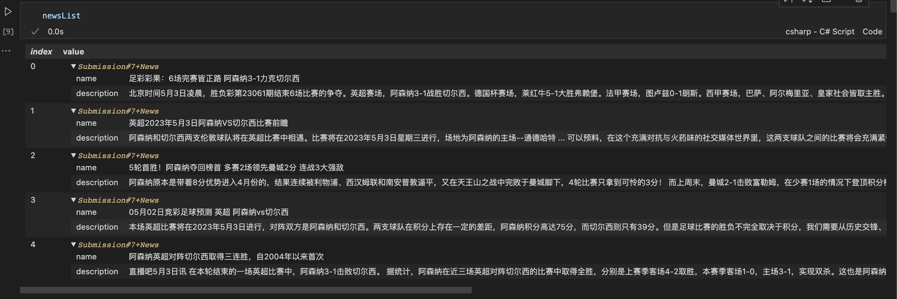
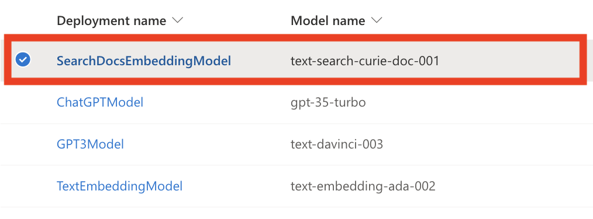
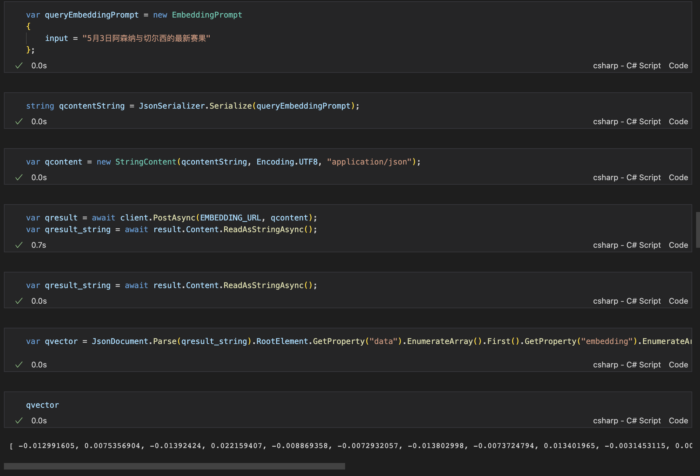
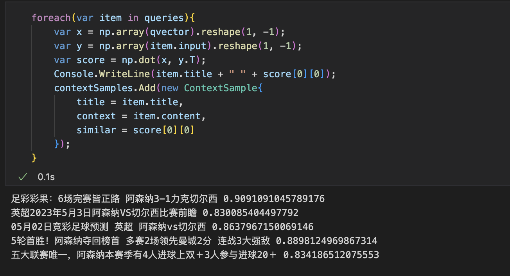
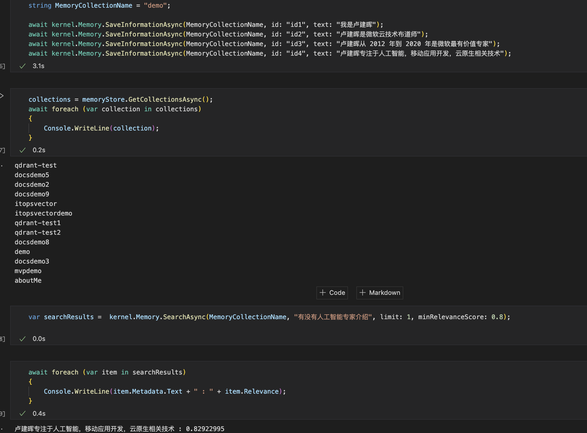

# **第四章. 通过语义嵌入 Embeddings 来调教你的 OpenAI 模型**

很多行业希望拥有 OpenAI 的能力，希望 OpenAI 能解决自己的企业内部问题。这就包括员工相关的内容入入职须知，请假和报销流程，还有福利查询等，企业业务流相关的内容包括相关文档，法规，执行流程等，也有一些面向客户的查询。虽然 OpenAI 有强大的知识能力，但是基于行业的数据和知识是没办法获取的。那如何注入这些基于行业的知识内容呢？这也是让 OpenAI 迈入企业化重要的一步。本章我们就会和大家讲讲如何注入行业的数据和知识，让 OpenAI 变得更专业。

## **4.1. 从自然语言中的向量谈起**

在自然语言领域，我们知道最细的粒度是词，词组成句，句构成段落，篇章和最后的文档。计算机是不认识词的，所以我们需要对词转换为数学上的表示。这个表示就是向量，也就是 Vector。向量是一个数学上的概念，它是一个有方向的量，有大小和方向。 有了向量，我们可以有效地对文本进行向量化，这也是计算机自然语言领域的基础。在自然语言处理领域，我们有很多向量化的方法，比如 One-hot，TF-IDF，Word2Vec，Glove，ELMO，GPT，BERT 等。这些向量化的方法都有各自的优缺点，但是都是基于词的向量化，也就是词向量。词向量是自然语言处理的基础，也是 OpenAI 所有模型的基础。我们分别看看词向量里面的几种常见方法。

### **4.1.1 One-hot 编码**

One-hot 编码，是用 0 和 1 的编码方式来表示词。比如我们有 4 个词，分别是：`我`，`爱`，`北京`，`天安门`。那么我们可以用 4 个向量来表示这 4 个词，分别是：

```

我 = [1, 0, 0, 0]
爱 = [0, 1, 0, 0]
北京 = [0, 0, 1, 0]
天安门 = [0, 0, 0, 1]

```

在传统的自然语言应用场景中，我们把每个词看成用 One-Hot 向量表示，作为唯一的离散符号。我们的词库中有单词的数量就是向量的维度，如上述的例子总共包含了四个词，所以我们可以用一个四维的向量来表示。在这个向量中，每个词都是唯一的，也就是说每个词都是独立的，没有任何关系。这样的向量我们称为 One-Hot 向量。One-Hot 向量的优点是简单，容易理解，而且每个词都是唯一的，没有任何关系。但是 One-Hot 向量的缺点也很明显，就是向量的维度会随着词的增加而增加。比如我们有 1000 个词，那么我们的向量就是 1000 维的。这样的向量是非常稀疏的，也就是大部分的值都是 0。这样的向量会导致计算机的计算量非常大，而且也不利于计算机的计算。所以 One-Hot 编码的缺点就是向量维度大，计算量大，计算效率低。

### **4.1.2. TF-IDF 编码**

TF-IDF 是一个统计学，通过评估一个词对一个语料的重要程度。TF-IDF 是 Term Frequency - Inverse Document Frequency 的缩写，中文叫做词频-逆文档频率。TF-IDF 的主要思想是：如果某个词在一篇文章中出现的频率高，并且在其他文章中很少出现，那么这个词就是这篇文章的关键词。一般我们习惯把这个概念拆分，分为 TF 和 IDF 两个部分。

**TF - 词频**

词频（Term Frequency）指的是某个词在文章中出现的频率。词频的计算公式如下：

```

TF = 某个词在文章中出现的次数 / 文章的总词数

```

TF 有一个问题，就是如果一个词在文章中出现的次数很多，那么这个词的 TF 值就会很大。这样的话，我们就会认为这个词是这篇文章的关键词。但是这样的话，我们会发现，很多词都是这篇文章的关键词，这样的话，我们就无法区分哪些词是这篇文章的关键词了。所以我们需要对 TF 进行一些调整，这个调整就是 IDF。

**IDF - 逆文档频率**

逆文档频率（Inverse Document Frequency）指的是某个词在所有文章中出现的频率。逆文档频率的计算公式如下：

```

IDF = log(语料库的文档总数 / (包含该词的文档数 + 1))

```

IDF 的计算公式中，分母加 1 是为了避免分母为 0 的情况。IDF 的计算公式中，语料库的文档总数是固定的，所以我们只需要计算包含该词的文档数就可以了。如果一个词在很多文章中都出现，那么这个词的 IDF 值就会很小。如果一个词在很少的文章中出现，那么这个词的 IDF 值就会很大。这样的话，我们就可以通过 TF 和 IDF 的乘积来计算一个词的 TF-IDF 值。TF-IDF 的计算公式如下：

```

TF-IDF = TF * IDF

```

TF-IDF 经常用于文本分类的场景，这也是 TF-IDF 最常用的场景。TF-IDF 的优点是简单，容易理解，而且计算量也不大。TF-IDF 的缺点是没有考虑词的顺序，而且没有考虑词与词之间的关系。所以 TF-IDF 适合用于文本分类的场景，而不适合用于文本生成的场景。


### **4.1.3. Word2Vec 编码**

Word2Vec 我们也叫它做 Word Embeddings，中文叫做词嵌入。Word2Vec 的主要思想是：一个词的语义可以通过它的上下文来确定。Word2Vec 有两种模型，分别是 CBOW 和 Skip-Gram。CBOW 是 Continuous Bag-of-Words 的缩写，中文叫做连续词袋模型。Skip-Gram 是 Skip-Gram Model 的缩写，中文叫做跳字模型。CBOW 模型的思想是通过一个词的上下文来预测这个词。Skip-Gram 模型的思想是通过一个词来预测这个词的上下文。Word2Vec 的优点是可以得到词的语义，而且可以得到词与词之间的关系。对比起 One-Hot 编码和 TF-IDF 编码，Word2Vec 编码的优点是可以得到词的语义，而且可以得到词与词之间的关系。Word2Vec 编码的缺点是计算量大，而且需要大量的语料库。

之前我们提及过，One-Hot 编码的维度是词的个数，而 Word2Vec 编码的维度是可以指定的。一般我们会指定为 100 维或者 300 维。Word2Vec 编码的维度越高，词与词之间的关系就越丰富，但是计算量也就越大。Word2Vec 编码的维度越低，词与词之间的关系就越简单，但是计算量也就越小。Word2Vec 编码的维度一般是 100 维或者 300 维，这样的维度可以满足大部分的应用场景。


Word2Vec 编码的计算公式非常简单，就是 Word Embeddings。Word Embeddings 是一个词向量，它的维度是可以指定的。Word Embeddings 的维度一般是 100 维或者 300 维，这样的维度可以满足大部分的应用场景。Word Embeddings 的计算公式如下：

``` 

Word Embeddings = 词的语义 + 词与词之间的关系

```

可以把 Word2Vec 看作是简单化的神经网络。


### **4.1.4. GPT 模型**

GPT 模型的全称是 Generative Pre-Training，中文叫做预训练生成模型。GPT 模型是 OpenAI 在 2018 年提出的，它的主要思想是：一个词的语义可以通过它的上下文来确定。GPT 模型的优点是可以得到词的语义，而且可以得到词与词之间的关系。GPT 模型的缺点是计算量大，而且需要大量的语料库。GPT 模型的结构是一个多层单向的 Transformer 结构，它的结构如下图所示：


训练过程是两个阶段，第一个阶段是预训练，第二个阶段是微调。预训练的语料是维基百科和 BookCorpus，微调的语料是不同的自然语言任务。预训练的目标是通过一个词的上下文来预测这个词，微调的目标是根据不同的自然语言任务，如文本分类、文本生成、问答系统等，对语义模型进行微调，得到不同的模型。

GPT 模型已经经历了 4 个阶段，最为出名的就是 ChatGPT 所使用的 GPT-3.5 以及 GPT 4 。GPT 开启了全新的时代，它的出现让我们看到了自然语言处理的无限可能。GPT 模型的优点是可以得到词的语义，而且可以得到词与词之间的关系。GPT 模型的缺点是计算量大，而且需要大量的语料库。很多人希望拥有自己行业对标的 GPT ，这也是我们本章需要解决的问题。


### **4.1.5. BERT 编码**

BERT 是 Bidirectional Encoder Representations from Transformers 的缩写，中文叫做双向编码器的 Transformer。BERT 是一个预训练的模型，它的训练语料是维基百科和 BookCorpus。BERT 的主要思想是：一个词的语义可以通过它的上下文来确定。BERT 的优点是可以得到词的语义，而且可以得到词与词之间的关系。对比起 One-Hot 编码、TF-IDF 编码和 Word2Vec 编码，BERT 编码的优点是可以得到词的语义，而且可以得到词与词之间的关系。BERT 编码的缺点是计算量大，而且需要大量的语料库。


## **4.2 Embeddings 嵌入技术**

在第一节中我们提及了 One-Hot 编码、TF-IDF 编码、Word2Vec 编码、BERT 编码和 GPT 模型。这些编码和模型都是 Embeddings 嵌入技术的一种。Embeddings 嵌入技术的主要思想是：一个词的语义可以通过它的上下文来确定。Embeddings 嵌入技术的优点是可以得到词的语义，而且可以得到词与词之间的关系。Embeddings 是作为自然语言深度学习的基础，它的出现让我们看到了自然语言处理的无限可能。

对于文本内容的 Embeddings 方法，我们结合上一节，你会发现从 word2vec 技术诞生后，文本内容的 Embeddings 就不断得到加强，从 word2vec 到 GPT 再到 BERT ,Embeddings 技术的效果越来越好 。Embeddings 技术的本质就是“压缩”，用更少的维度来表示更多的信息。这样的好处是可以节省存储空间，提高计算效率。

在 OpenAI 中，Embeddings 技术的应用非常广泛，将文本字符串转换为浮点向量，通过向量之间的距离来衡量文本之间的相似度。不同行业希望加入自己的数据 我们就可以把这些企业级的数据通过 OpenAI Embeddings - text-embedding-ada-002 模型查询出向量，并通过映射进行保存，在使用时将问题也转换为向量，通过相似度的算法对比，找出最接近的 TopN 结果，从而找到与问题相关联的企业内容。

我们可以通过向量数据库将企业数据向量化后保存，结合 text-embedding-ada-002模型通过向量的相似度进行查询，从而找到与问题相关联的企业内容。现在常用的向量数据库就包括 Qdrant, Milvus, Faiss, Annoy, NMSLIB 等。


### **4.2.1 Open AI 的 Embeddings 模型**

OpenAI 的文本嵌入向量文本字符串的相关性。 嵌入通常用于以下场景

1. 搜索（结果按与查询字符串的相关性排序）
2. 聚类（其中文本字符串按相似性分组）
3. 推荐（推荐具有相关文本字符串的项目）
4. 异常检测（识别出相关性很小的异常值）
5. 多样性测量（分析相似性分布）
6. 分类（其中文本字符串按其最相似的标签分类）

嵌入是浮点数的向量（列表）。 两个向量之间的距离衡量它们的相关性。 小距离表示高相关性，大距离表示低相关性。 例如，如果您有一个嵌入为[0.1,0.2,0.3]的字符串“狗”，则该字符串与嵌入为[0.2,0.3,0.4]的字符串“猫”比与嵌入为[0.9,0.8,0.7]的字符串“汽车”更相关。

我们可以尝试引入一些时效性的问题来测试下 OpenAI 的 Embeddings 模型的效果。来看看例子

**案例** -  我们在 ChatGPT 中经常会问一些时效性的问题，例如以下场景



这个答案对吗？这是一个错误的答案，因为在 2023 年 5 月 3 日凌晨阿森纳是 3:1 战胜了切尔西。这是一个错误的结果。产生这个错误是因为 ChatGPT 不具备时效性。这个时候我们就需要给 GPT 一些时效性的信息，我们可以结合之前说的 Bing Search 来完成相关材料的补充。通过这些资料通过向量化去配对问题。(如果你不知道如何使用 Bing Search , 请参考第三章的内容)。因为这是搜索结果，所以这里我希望启动两个模型 text-search-curie-doc-001 来配对并进行转化。找到与问题和内容最相近的前三个作为样本嵌入，来看看效果。



我们可以通过 Bing 搜索找到最佳的 5 个答案



接下来我们在 Azure OpenAI Portal 部署 text-search-curie-doc-001 



```csharp

int n = 0 ;
foreach(var item in docs)
{
    var contentString = JsonSerializer.Serialize(item);
    var content = new StringContent(contentString, Encoding.UTF8, "application/json");
    var result = await client.PostAsync(EMBEDDING_URL, content);
    var result_string = await result.Content.ReadAsStringAsync();
    var vector = JsonDocument.Parse(result_string).RootElement.GetProperty("data").EnumerateArray().First().GetProperty("embedding").EnumerateArray().Select(x => x.GetDouble()).ToList<double>();
    var query = new QueryEmbeddingPrompt
    {
        title = newsList[n].name,
        content = newsList[n].description,
        input = vector
    };
    queries.Add(query);
    n++;
}


```

我们也需要把问题 "2023年5月3日阿森纳与切尔西的赛果" 做向量转化



我们可以通过 NumSharp 把问题和找到内容进行相似性映射，以找到最佳的三个答案，作为少样本。



然后就可以作为少样本进行提示，当再问一次“5月3日阿森纳与切尔西的赛果”就会有相关内容给出


如果你想了解更多可以参考 ./Code/04.Embeddings/01.EmbeddingsWithBing.ipynb

这个是我们把时效内容向量化后配对合适的内容作为少样本的案例，实际上我们也可以把这些准确的语料保存。这个时候我们就需要向量数据库来解决。


### **4.2.2 向量数据库 - Qdrant**

随着 OpenAI 有更多企业级别的落地，向量数据库也越来越受到关注。用好向量数据库，可以让我们的业务更加高效。向量数据库的主要功能是将向量数据进行存储和查询。向量数据库的优点是可以快速查询，结合 OpenAI Embeddings 模型 - text-embedding-ada-002 可以打造自身企业的知识图谱，从而提高企业的效率。

Qdrant（读作：quadrant）是一个向量相似度搜索引擎。 它提供了一个生产就绪的服务，带有一个方便的 API 来存储、搜索和管理点——带有额外有效负载的矢量。 Qdrant 专为扩展过滤支持而定制。 它使它可用于各种神经网络或基于语义的匹配、分面搜索和其他应用程序。

Semantic Kernel 支持 Qdrant 的调用，我们可以结合 Semantic Kernel 和 Qdrant 来实现知识图谱。使用方式如下：

1. 你必须安装 Docker https://www.docker.com/products/docker-desktop/ 

2. 完成本地 Qdrant 的安装


```bash

docker pull qdrant/qdrant

```

   安装完后，启动 Qdrant


```bash

docker run -p 6333:6333 \
    -v $(pwd)/path/to/data:/qdrant/storage \
    qdrant/qdrant

```


3. 打开 ./Code/04.Embeddings/02.SKQdrantDemo.ipynb ，运行





通过向量数据库你可以嵌入不同的专业数据，我们会在最后一章介绍更多的内容。

## **4.3 Embeddings vs Fine-Tuning**

 通过 Embeddings 语义嵌入或者 Fine-Tuning 微调对大规模语言模型 (GPT-3/3.5/4) 进行使用，是受人瞩目的技术话题。虽然 Embeddings 语义嵌入和微调都是可以注入大规模语言模型的不同注释和语义的技术，但是它们的应用场景和使用方式是不同的。利用本节和大家说说 Embeddings 嵌入和微调的区别和使用场景。


### **4.3.1 从概念说起**

**语义嵌入** - 如上面提及的语义嵌入是文本的向量表示，可捕获单词或短语的语义。 通过比较和分析这些向量，可以辨别文本元素之间的异同。

利用语义嵌入进行搜索可以快速有效地检索相关信息，尤其是在大型数据集中。 与微调相比，语义搜索具有多项优势，例如更快的搜索速度、更低的计算成本以及防止虚构或事实捏造。 由于这些好处，当目标是访问模型中的特定知识时，语义搜索通常受到青睐。嵌入在各个领域都有应用，包括推荐引擎、搜索功能和文本分类。 

在语义嵌入中，我们会遇到以下的挑战

1. 高维度而增加的复杂性 - 大型语言模型生成的嵌入通常具有高维，这会导致计算复杂性和存储需求增加。 这使得执行时变得复杂。
   
2. 向量出现稀疏矩阵 - 嵌入可能导致稀疏表示，其中向量中的大多数元素都是零或接近零的值。 这种稀疏性会导致相似性搜索或其他任务期间内存消耗增加和计算时间变慢。
   
3. 可解释性 - 嵌入通常难以解释，因为它们表示高维空间中的复杂关系。 这种可解释性的缺乏使得诊断问题（例如嵌入中的偏差或不准确）以及理解模型的潜在推理变得具有挑战性。
   
4. 数据质量 - 嵌入的有效性在很大程度上取决于用于训练大型语言模型的输入数据质量。不正确的数据可能导致嵌入效果不理想，
   
5. 专业性 - 虽然预训练的 LLM 可以生成通用嵌入，但将这些嵌入适应特定领域或任务可能需要对特定领域数据进行额外的微调或训练。 此过程可能会占用大量资源，并且需要模型训练和优化方面的专业知识。

6. 道德：嵌入可能会无意中捕获并延续训练数据中存在的偏见，例如性别、种族或文化偏见。 然后，这些偏差会影响模型在下游任务中的行为，引发对公平性和伦理影响的担忧。


**微调** - 微调是一种用于改进预训练模型（例如聊天机器人）性能的技术。 通过提供示例和调整模型的参数，微调使模型能够为特定任务生成更准确和上下文相关的响应。 这些任务的范围从聊天机器人对话和代码生成到问题形成，确保更好地与所需输出保持一致。 该过程类似于神经网络在训练期间调整其权重。作为迁移学习的一种形式，微调可以调整预训练模型来执行新任务，而无需进行大量的再训练。 该过程涉及对模型的参数进行微调，使其能够更好地执行目标任务。

对 GPT-3 等大型语言模型 (LLM) 进行微调会带来一些挑战，这些挑战可能会影响其效率、可扩展性和有效性。 这就包括：

1. 算力成本 - 微调 LLM 需要大量计算资源，这可能很昂贵，而且对于预算有限的组织或研究人员来说可能不可行。 这些成本会限制微调在使用中的可扩展性。

2. 语料质量问题 - 高质量和相关的语料数据对于成功进行微调至关重要。 高质量的语料从自然语言开始就是很难找到的, 引入质量差的语料可能影响模型性能的偏差或不准确的风险。胡说八道的机会增加。
   
3. 过度拟合 - 过度拟合发生在模型对训练数据过于专业化时，导致对新示例的泛化能力较差。 如何在专业化和泛化之间的平衡对于实现最佳性能至关重要。
   
4. 胡说八道：微调 LLM 有时会导致虚构，即模型产生不正确或捏造的信息，以及幻觉，即它产生似是而非但不正确的答案。 这可能会破坏模型输出的可靠性和可信度。
   
5. 模型适应性：当新信息或更新知识可用时，可能需要重新微调模型。 此过程可能会占用大量资源且繁琐，尤其是在需要经常更新模型以保持最新和相关性的情况下。
 
6. 道德：微调 LLM 可能会导致潜在的偏见，因为它们可能会无意中从训练数据中学习和传播有害的刻板印象或错误信息。 确保微调模型的道德使用和输出可能具有挑战性，需要不断监测和评估。


### **4.3.2 如何选择**

语义嵌入和微调是利用 GPT-3 等语言模型的两个主要方法。 微调专注于通过迁移学习教授模型新任务，而语义嵌入涉及将文本的含义转换为向量表示，可用于语义搜索和信息检索等任务。

语义搜索，也称为神经搜索或矢量搜索，使数据库能够根据语义而不是仅根据关键字或索引来搜索和检索信息。 这种方法具有高度可扩展性，通常比针对特定任务微调模型更快且更具成本效益。

相比之下，微调可能非常耗时、复杂且成本高昂，并且不会从本质上增强模型存储和检索新信息的能力。 但通过微调的数据，很多时候不能的出正确的效果，依然会胡说八道。在使用嵌入和微调问答之间的选择取决于具体要求和问题的复杂性。 对于更简单的搜索任务，嵌入可以更有效且更容易实现，而对于更复杂的问答场景，微调可能会提供更好的结果。


## **4.4 本章小结**

本章我们介绍了语义嵌入 Embeddings 来调教你的模型，让你能注入行业应用数据，让模型更加专业化。在引入前，我们还把以往自然语言的处理方法做了一个简单的回顾，让你能更好的理解语义嵌入的优势。当然我们也比较了语义嵌入和微调的优缺点，让你能更好的选择适合你的场景。希望通过贲张的学习你能有一个更好的理解。


### **相关资料**

1. 关于语义嵌入 Embeddings https://learn.microsoft.com/zh-cn/azure/cognitive-services/openai/tutorials/embeddings

2. 关于 Qdrant https://qdrant.tech/


